# UML Diagrams — Fitur Administrator (Admin) BananaVision v3.2

Dokumentasi ini berisi daftar lengkap diagram UML yang dirancang khusus untuk fitur administrator pada sistem **BananaVision**. Semua diagram di bawah menggunakan sintaks **PlantUML** untuk mempermudah render.

---

## Daftar Isi Diagram Admin
1. **Activity Diagrams (Swimlanes)**
   - Swimlane 1: Autentikasi Login Admin
   - Swimlane 2: Lihat Dashboard Admin (Statistik Global)
   - Swimlane 3: Kelola Data Penyakit (CRUD & Toggle Status)
   - Swimlane 4: Kelola Model ML (Upload, Aktivasi, Hapus)
   - Swimlane 5: Cek Status / Kesiapan Server ML (Health Check)
2. **Sequence Diagrams (BCE - Boundary-Control-Entity)**
   - BCE Sequence 1: Login Admin
   - BCE Sequence 2: Lihat Dashboard Admin (Statistik Global)
   - BCE Sequence 3: Kelola Data Penyakit — View & Search
   - BCE Sequence 4: Kelola Data Penyakit — Tambah Penyakit (Create)
   - BCE Sequence 5: Kelola Data Penyakit — Edit Penyakit (Update)
   - BCE Sequence 6: Kelola Data Penyakit — Toggle Status Tampil (Active Status)
   - BCE Sequence 7: Kelola Data Penyakit — Hapus Penyakit (Delete)
   - BCE Sequence 8: Kelola Model ML — Upload Model
   - BCE Sequence 9: Kelola Model ML — Aktifkan Model (Hot-Reload)
   - BCE Sequence 10: Kelola Model ML — Hapus Model
   - BCE Sequence 11: ML Server Health Status Check
   - BCE Sequence 12: Login User (Google OAuth)

---

## 1. Activity Diagrams (Swimlanes)

### Swimlane 1: Autentikasi Login Admin
> Menjelaskan alur masuk bagi admin menggunakan kredensial email & password, dicocokkan dengan enkripsi bcrypt, hingga pemberian token JWT.

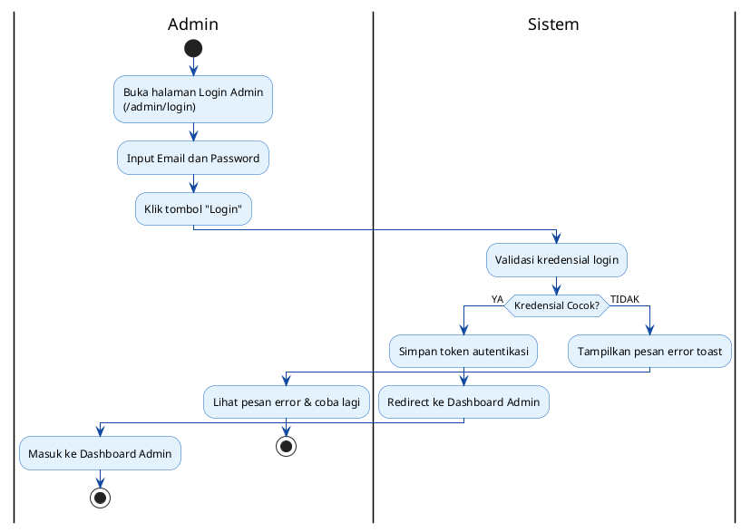
```plantuml
@startuml
skinparam ActivityBorderColor #1565C0
skinparam ActivityBackgroundColor #E3F2FD
skinparam ArrowColor #0D47A1

|Admin|
start
:Buka halaman Login Admin\n(/admin/login);
:Input Email dan Password;
:Klik tombol "Login";

|Sistem|
:Validasi kredensial login;
if (Kredensial Cocok?) then (YA)
  :Simpan token autentikasi;
  :Redirect ke Dashboard Admin;
  |Admin|
  :Masuk ke Dashboard Admin;
  stop
else (TIDAK)
  |Sistem|
  :Tampilkan pesan error toast;
  |Admin|
  :Lihat pesan error & coba lagi;
  stop
endif
@enduml
```

### Swimlane 2: Lihat Dashboard Admin (Statistik Global)
> Menjelaskan pemrosesan dan perolehan metrik global seperti total pengguna, total analisis, total feedback, total jenis penyakit, dan data terbaru.

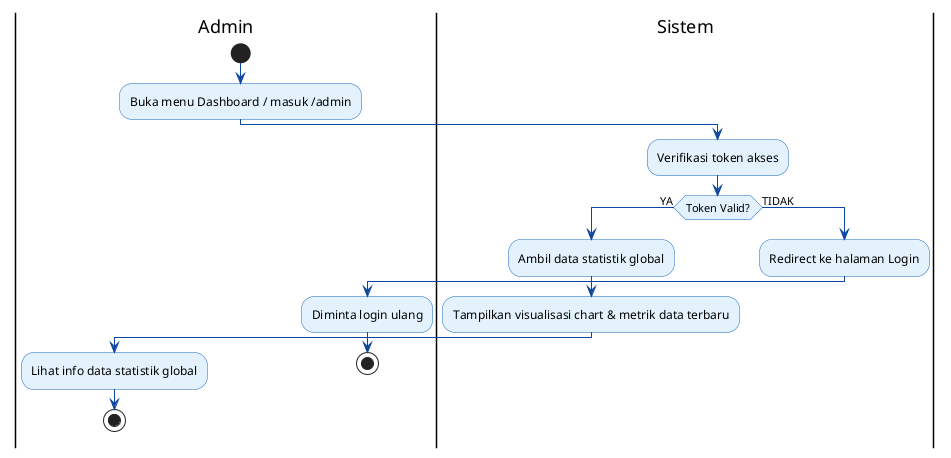
```plantuml
@startuml
skinparam ActivityBorderColor #1565C0
skinparam ActivityBackgroundColor #E3F2FD
skinparam ArrowColor #0D47A1

|Admin|
start
:Buka menu Dashboard / masuk /admin;

|Sistem|
:Verifikasi token akses;
if (Token Valid?) then (YA)
  :Ambil data statistik global;
  :Tampilkan visualisasi chart & metrik data terbaru;
  |Admin|
  :Lihat info data statistik global;
  stop
else (TIDAK)
  |Sistem|
  :Redirect ke halaman Login;
  |Admin|
  :Diminta login ulang;
  stop
endif
@enduml
```

### Swimlane 3: Kelola Data Penyakit (CRUD & Toggle Status)
> Alur kelola data penyakit tanaman pisang, mencakup operasi Create, Read, Update, Delete (Soft-Delete), dan Toggle visibilitas publik.

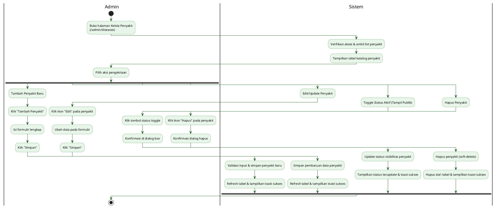
```plantuml
@startuml
skinparam ActivityBorderColor #2E7D32
skinparam ActivityBackgroundColor #E8F5E9
skinparam ArrowColor #1B5E20

|Admin|
start
:Buka halaman Kelola Penyakit\n(/admin/diseases);

|Sistem|
:Verifikasi akses & ambil list penyakit;
:Tampilkan tabel katalog penyakit;

|Admin|
:Pilih aksi pengelolaan;

fork
  :Tambah Penyakit Baru;
  |Admin|
  :Klik "Tambah Penyakit";
  :Isi formulir lengkap;
  :Klik "Simpan";
  |Sistem|
  :Validasi input & simpan penyakit baru;
  :Refresh tabel & tampilkan toast sukses;

fork again
  :Edit/Update Penyakit;
  |Admin|
  :Klik ikon "Edit" pada penyakit;
  :Ubah data pada formulir;
  :Klik "Simpan";
  |Sistem|
  :Simpan pembaruan data penyakit;
  :Refresh tabel & tampilkan toast sukses;

fork again
  :Toggle Status Aktif (Tampil Publik);
  |Admin|
  :Klik tombol status toggle;
  :Konfirmasi di dialog box;
  |Sistem|
  :Update status visibilitas penyakit;
  :Tampilkan status terupdate & toast sukses;

fork again
  :Hapus Penyakit;
  |Admin|
  :Klik ikon "Hapus" pada penyakit;
  :Konfirmasi dialog hapus;
  |Sistem|
  :Hapus penyakit (soft-delete);
  :Hapus dari tabel & tampilkan toast sukses;
end fork

|Admin|
stop
@enduml
```

### Swimlane 4: Kelola Model ML (Upload, Aktivasi, Hapus)
> Menyajikan visualisasi sinkronisasi model AI antara file sistem backend (.keras), cloud storage Supabase, database MongoDB, dan memori ML Server.

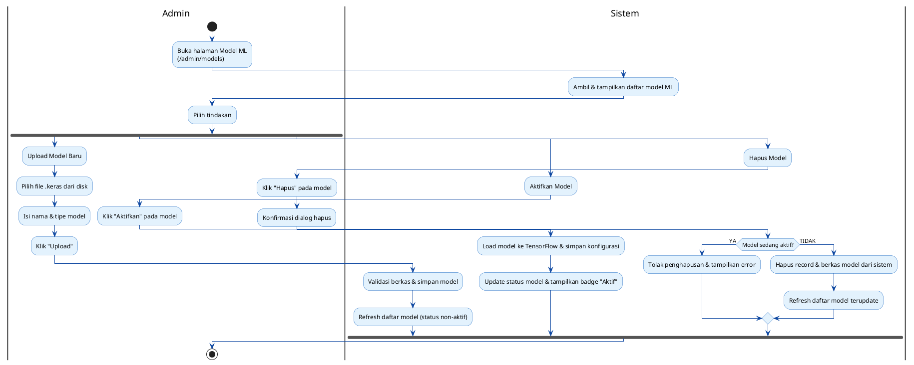
```plantuml
@startuml
skinparam ActivityBorderColor #1565C0
skinparam ActivityBackgroundColor #E3F2FD
skinparam ArrowColor #0D47A1

|Admin|
start
:Buka halaman Model ML\n(/admin/models);

|Sistem|
:Ambil & tampilkan daftar model ML;

|Admin|
:Pilih tindakan;

fork
  :Upload Model Baru;
  |Admin|
  :Pilih file .keras dari disk;
  :Isi nama & tipe model;
  :Klik "Upload";
  |Sistem|
  :Validasi berkas & simpan model;
  :Refresh daftar model (status non-aktif);

fork again
  :Aktifkan Model;
  |Admin|
  :Klik "Aktifkan" pada model;
  |Sistem|
  :Load model ke TensorFlow & simpan konfigurasi;
  :Update status model & tampilkan badge "Aktif";

fork again
  :Hapus Model;
  |Admin|
  :Klik "Hapus" pada model;
  :Konfirmasi dialog hapus;
  |Sistem|
  if (Model sedang aktif?) then (YA)
    :Tolak penghapusan & tampilkan error;
  else (TIDAK)
    :Hapus record & berkas model dari sistem;
    :Refresh daftar model terupdate;
  end if
end fork

|Admin|
stop
@enduml
```

### Swimlane 5: Cek Status / Kesiapan Server ML (Health Check)
> Menjelaskan pemantauan kesehatan model server secara real-time dari panel admin.

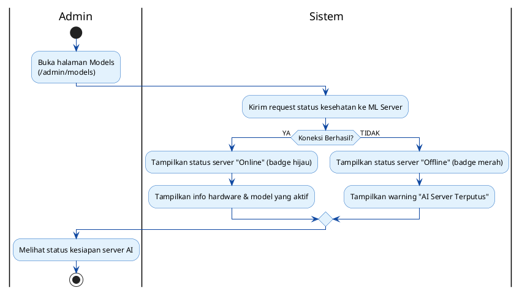
```plantuml
@startuml
skinparam ActivityBorderColor #1565C0
skinparam ActivityBackgroundColor #E3F2FD
skinparam ArrowColor #0D47A1

|Admin|
start
:Buka halaman Models\n(/admin/models);

|Sistem|
:Kirim request status kesehatan ke ML Server;
if (Koneksi Berhasil?) then (YA)
  :Tampilkan status server "Online" (badge hijau);
  :Tampilkan info hardware & model yang aktif;
else (TIDAK)
  :Tampilkan status server "Offline" (badge merah);
  :Tampilkan warning "AI Server Terputus";
endif

|Admin|
:Melihat status kesiapan server AI;
stop
@enduml
```

---

## 2. Sequence Diagrams (BCE)

Pola **Boundary-Control-Entity (BCE)** digunakan untuk memisahkan antara elemen antarmuka pengguna (Boundary), pemroses logika (Control), dan model penyimpanan data (Entity). Setiap diagram di bawah ini telah disederhanakan agar masing-masing hanya menggunakan satu objek Boundary, satu objek Control, dan satu objek Entity, serta Boundary dinamai sesuai dengan halaman/dialog yang sedang dibuka oleh pengguna.

### BCE Sequence 1: Login Admin
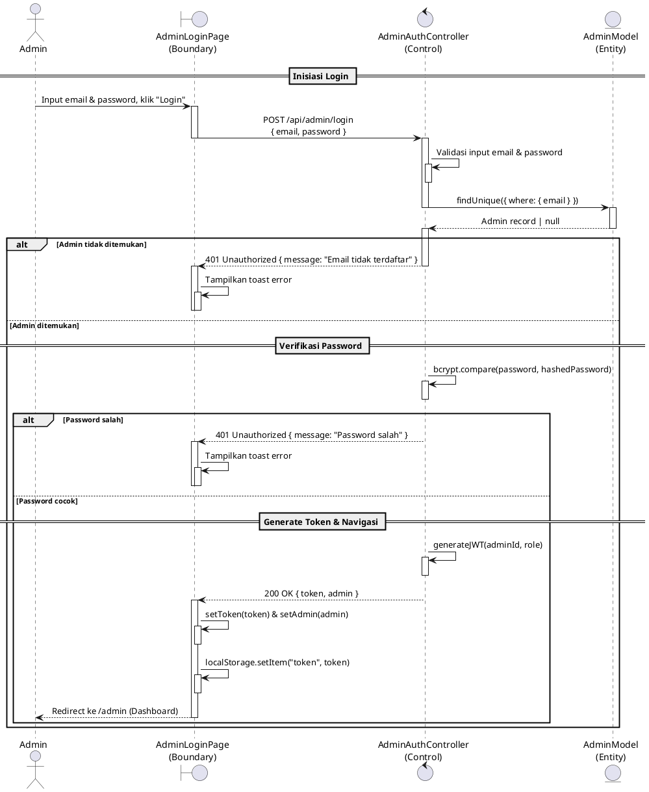
```plantuml
@startuml
skinparam sequenceMessageAlign center
skinparam responseMessageBelowArrow true

actor Admin

' === BOUNDARY ===
boundary "AdminLoginPage\n(Boundary)" as B

' === CONTROL ===
control "AdminAuthController\n(Control)" as C

' === ENTITY ===
entity "AdminModel\n(Entity)" as E

== Inisiasi Login ==

Admin -> B : Input email & password, klik "Login"
activate B

B -> C : POST /api/admin/login\n{ email, password }
deactivate B
activate C

C -> C : Validasi input email & password
activate C
deactivate C

C -> E : findUnique({ where: { email } })
deactivate C
activate E

E --> C : Admin record | null
deactivate E
activate C

alt Admin tidak ditemukan
  C --> B : 401 Unauthorized { message: "Email tidak terdaftar" }
  deactivate C
  activate B
  B -> B : Tampilkan toast error
  activate B
  deactivate B
  deactivate B

else Admin ditemukan

  == Verifikasi Password ==

  C -> C : bcrypt.compare(password, hashedPassword)
  activate C
  deactivate C

  alt Password salah
    C --> B : 401 Unauthorized { message: "Password salah" }
    deactivate C
    activate B
    B -> B : Tampilkan toast error
    activate B
    deactivate B
    deactivate B

  else Password cocok

    == Generate Token & Navigasi ==

    C -> C : generateJWT(adminId, role)
    activate C
    deactivate C

    C --> B : 200 OK { token, admin }
    deactivate C
    activate B

    B -> B : setToken(token) & setAdmin(admin)
    activate B
    deactivate B

    B -> B : localStorage.setItem("token", token)
    activate B
    deactivate B

    B --> Admin : Redirect ke /admin (Dashboard)
    deactivate B
  end
end
@enduml
```

### BCE Sequence 2: Lihat Dashboard Admin (Statistik Global)
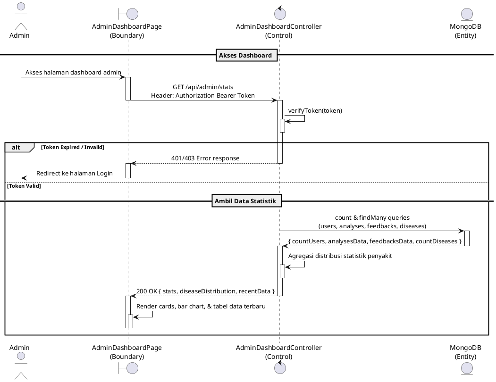
```plantuml
@startuml
skinparam sequenceMessageAlign center
skinparam responseMessageBelowArrow true

actor Admin

' === BOUNDARY ===
boundary "AdminDashboardPage\n(Boundary)" as B

' === CONTROL ===
control "AdminDashboardController\n(Control)" as C

' === ENTITY ===
entity "MongoDB\n(Entity)" as E

== Akses Dashboard ==

Admin -> B : Akses halaman dashboard admin
activate B

B -> C : GET /api/admin/stats\nHeader: Authorization Bearer Token
deactivate B
activate C

C -> C : verifyToken(token)
activate C
deactivate C

alt Token Expired / Invalid
  C --> B : 401/403 Error response
  deactivate C
  activate B
  B --> Admin : Redirect ke halaman Login
  deactivate B

else Token Valid

  == Ambil Data Statistik ==

  C -> E : count & findMany queries\n(users, analyses, feedbacks, diseases)
  deactivate C
  activate E

  E --> C : { countUsers, analysesData, feedbacksData, countDiseases }
  deactivate E
  activate C

  C -> C : Agregasi distribusi statistik penyakit
  activate C
  deactivate C

  C --> B : 200 OK { stats, diseaseDistribution, recentData }
  deactivate C
  activate B

  B -> B : Render cards, bar chart, & tabel data terbaru
  activate B
  deactivate B
  deactivate B
end
@enduml
```

### BCE Sequence 3: Kelola Data Penyakit — View & Search
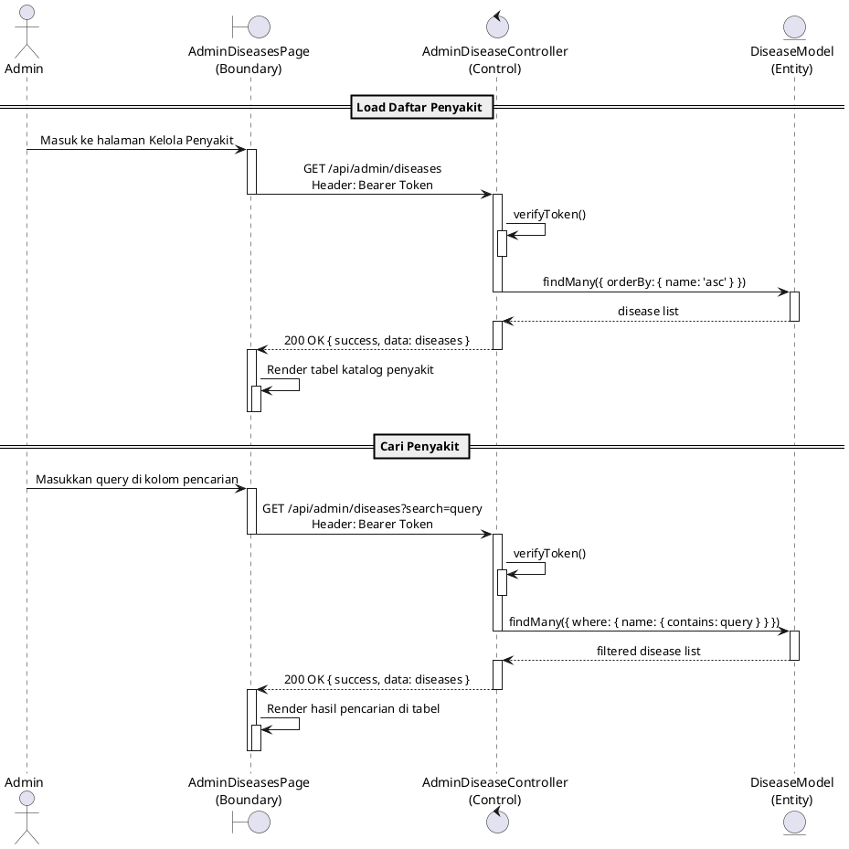
```plantuml
@startuml
skinparam sequenceMessageAlign center
skinparam responseMessageBelowArrow true

actor Admin

' === BOUNDARY ===
boundary "AdminDiseasesPage\n(Boundary)" as B

' === CONTROL ===
control "AdminDiseaseController\n(Control)" as C

' === ENTITY ===
entity "DiseaseModel\n(Entity)" as E

== Load Daftar Penyakit ==

Admin -> B : Masuk ke halaman Kelola Penyakit
activate B

B -> C : GET /api/admin/diseases\nHeader: Bearer Token
deactivate B
activate C

C -> C : verifyToken()
activate C
deactivate C

C -> E : findMany({ orderBy: { name: 'asc' } })
deactivate C
activate E

E --> C : disease list
deactivate E
activate C

C --> B : 200 OK { success, data: diseases }
deactivate C
activate B

B -> B : Render tabel katalog penyakit
activate B
deactivate B
deactivate B

== Cari Penyakit ==

Admin -> B : Masukkan query di kolom pencarian
activate B

B -> C : GET /api/admin/diseases?search=query\nHeader: Bearer Token
deactivate B
activate C

C -> C : verifyToken()
activate C
deactivate C

C -> E : findMany({ where: { name: { contains: query } } })
deactivate C
activate E

E --> C : filtered disease list
deactivate E
activate C

C --> B : 200 OK { success, data: diseases }
deactivate C
activate B

B -> B : Render hasil pencarian di tabel
activate B
deactivate B
deactivate B
@enduml
```

### BCE Sequence 4: Kelola Data Penyakit — Tambah Penyakit (Create)
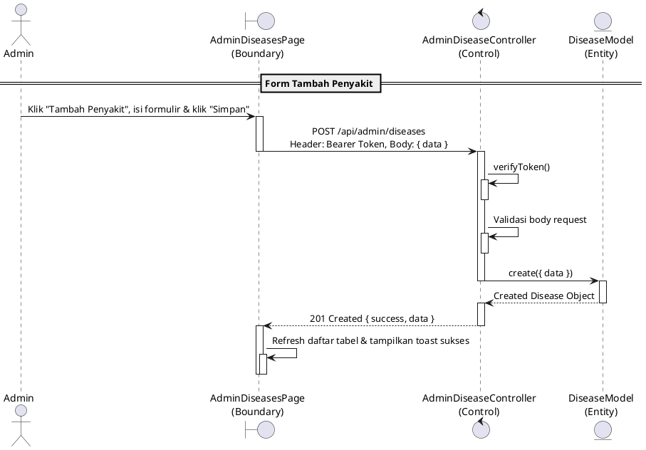
```plantuml
@startuml
skinparam sequenceMessageAlign center
skinparam responseMessageBelowArrow true

actor Admin

' === BOUNDARY ===
boundary "AdminDiseasesPage\n(Boundary)" as B

' === CONTROL ===
control "AdminDiseaseController\n(Control)" as C

' === ENTITY ===
entity "DiseaseModel\n(Entity)" as E

== Form Tambah Penyakit ==

Admin -> B : Klik "Tambah Penyakit", isi formulir & klik "Simpan"
activate B

B -> C : POST /api/admin/diseases\nHeader: Bearer Token, Body: { data }
deactivate B
activate C

C -> C : verifyToken()
activate C
deactivate C

C -> C : Validasi body request
activate C
deactivate C

C -> E : create({ data })
deactivate C
activate E

E --> C : Created Disease Object
deactivate E
activate C

C --> B : 201 Created { success, data }
deactivate C
activate B

B -> B : Refresh daftar tabel & tampilkan toast sukses
activate B
deactivate B
deactivate B
@enduml
```

### BCE Sequence 5: Kelola Data Penyakit — Edit Penyakit (Update)
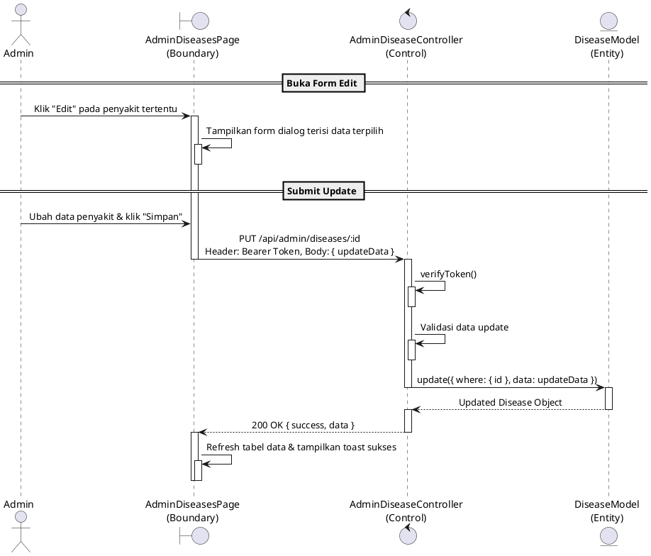
```plantuml
@startuml
skinparam sequenceMessageAlign center
skinparam responseMessageBelowArrow true

actor Admin

' === BOUNDARY ===
boundary "AdminDiseasesPage\n(Boundary)" as B

' === CONTROL ===
control "AdminDiseaseController\n(Control)" as C

' === ENTITY ===
entity "DiseaseModel\n(Entity)" as E

== Buka Form Edit ==

Admin -> B : Klik "Edit" pada penyakit tertentu
activate B

B -> B : Tampilkan form dialog terisi data terpilih
activate B
deactivate B

== Submit Update ==

Admin -> B : Ubah data penyakit & klik "Simpan"

B -> C : PUT /api/admin/diseases/:id\nHeader: Bearer Token, Body: { updateData }
deactivate B
activate C

C -> C : verifyToken()
activate C
deactivate C

C -> C : Validasi data update
activate C
deactivate C

C -> E : update({ where: { id }, data: updateData })
deactivate C
activate E

E --> C : Updated Disease Object
deactivate E
activate C

C --> B : 200 OK { success, data }
deactivate C
activate B

B -> B : Refresh tabel data & tampilkan toast sukses
activate B
deactivate B
deactivate B
@enduml
```

### BCE Sequence 6: Kelola Data Penyakit — Toggle Status Tampil (Active Status)
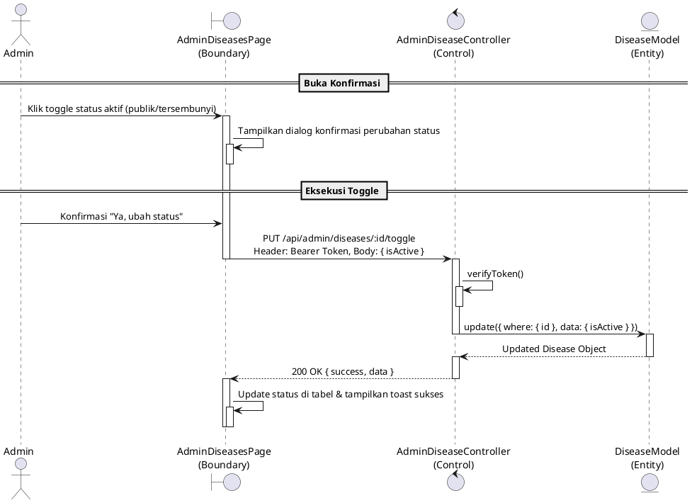
```plantuml
@startuml
skinparam sequenceMessageAlign center
skinparam responseMessageBelowArrow true

actor Admin

' === BOUNDARY ===
boundary "AdminDiseasesPage\n(Boundary)" as B

' === CONTROL ===
control "AdminDiseaseController\n(Control)" as C

' === ENTITY ===
entity "DiseaseModel\n(Entity)" as E

== Buka Konfirmasi ==

Admin -> B : Klik toggle status aktif (publik/tersembunyi)
activate B

B -> B : Tampilkan dialog konfirmasi perubahan status
activate B
deactivate B

== Eksekusi Toggle ==

Admin -> B : Konfirmasi "Ya, ubah status"

B -> C : PUT /api/admin/diseases/:id/toggle\nHeader: Bearer Token, Body: { isActive }
deactivate B
activate C

C -> C : verifyToken()
activate C
deactivate C

C -> E : update({ where: { id }, data: { isActive } })
deactivate C
activate E

E --> C : Updated Disease Object
deactivate E
activate C

C --> B : 200 OK { success, data }
deactivate C
activate B

B -> B : Update status di tabel & tampilkan toast sukses
activate B
deactivate B
deactivate B
@enduml
```

### BCE Sequence 7: Kelola Data Penyakit — Hapus Penyakit (Delete)
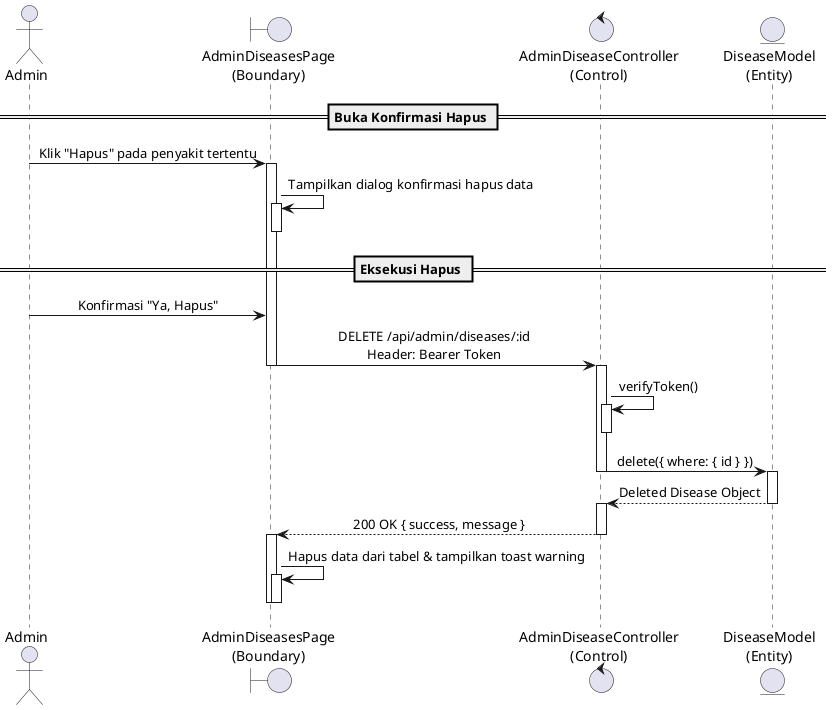
```plantuml
@startuml
skinparam sequenceMessageAlign center
skinparam responseMessageBelowArrow true

actor Admin

' === BOUNDARY ===
boundary "AdminDiseasesPage\n(Boundary)" as B

' === CONTROL ===
control "AdminDiseaseController\n(Control)" as C

' === ENTITY ===
entity "DiseaseModel\n(Entity)" as E

== Buka Konfirmasi Hapus ==

Admin -> B : Klik "Hapus" pada penyakit tertentu
activate B

B -> B : Tampilkan dialog konfirmasi hapus data
activate B
deactivate B

== Eksekusi Hapus ==

Admin -> B : Konfirmasi "Ya, Hapus"

B -> C : DELETE /api/admin/diseases/:id\nHeader: Bearer Token
deactivate B
activate C

C -> C : verifyToken()
activate C
deactivate C

C -> E : delete({ where: { id } })
deactivate C
activate E

E --> C : Deleted Disease Object
deactivate E
activate C

C --> B : 200 OK { success, message }
deactivate C
activate B

B -> B : Hapus data dari tabel & tampilkan toast warning
activate B
deactivate B
deactivate B
@enduml
```

### BCE Sequence 8: Kelola Model ML — Upload Model
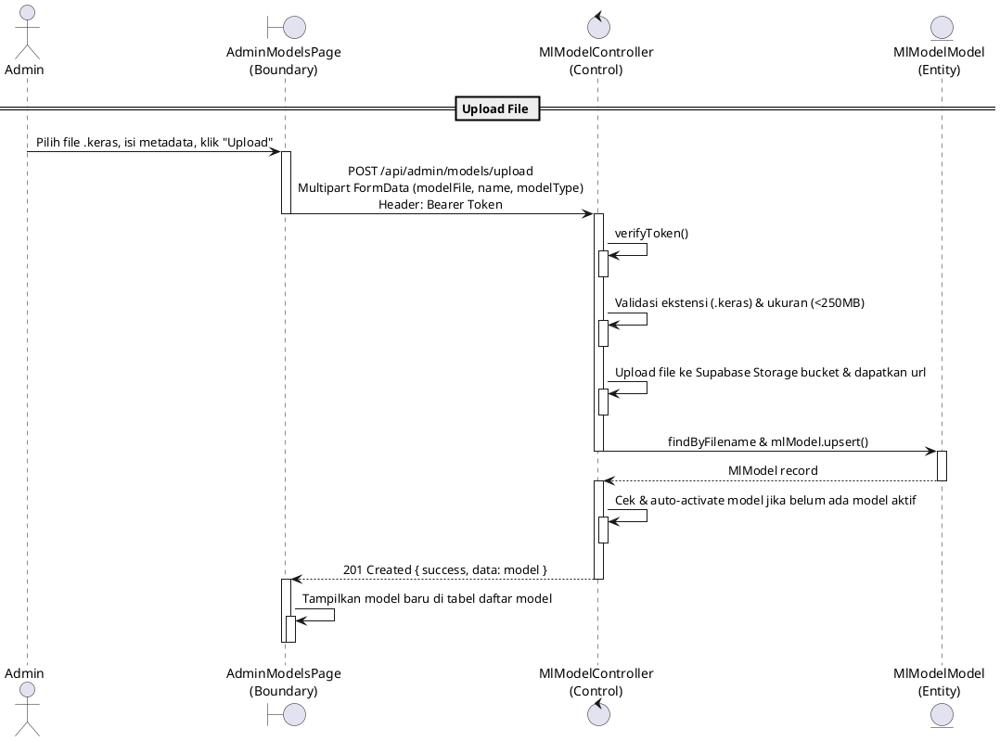
```plantuml
@startuml
skinparam sequenceMessageAlign center
skinparam responseMessageBelowArrow true

actor Admin

' === BOUNDARY ===
boundary "AdminModelsPage\n(Boundary)" as B

' === CONTROL ===
control "MlModelController\n(Control)" as C

' === ENTITY ===
entity "MlModelModel\n(Entity)" as E

== Upload File ==

Admin -> B : Pilih file .keras, isi metadata, klik "Upload"
activate B

B -> C : POST /api/admin/models/upload\nMultipart FormData (modelFile, name, modelType)\nHeader: Bearer Token
deactivate B
activate C

C -> C : verifyToken()
activate C
deactivate C

C -> C : Validasi ekstensi (.keras) & ukuran (<250MB)
activate C
deactivate C

C -> C : Upload file ke Supabase Storage bucket & dapatkan url
activate C
deactivate C

C -> E : findByFilename & mlModel.upsert()
deactivate C
activate E

E --> C : MlModel record
deactivate E
activate C

C -> C : Cek & auto-activate model jika belum ada model aktif
activate C
deactivate C

C --> B : 201 Created { success, data: model }
deactivate C
activate B

B -> B : Tampilkan model baru di tabel daftar model
activate B
deactivate B
deactivate B
@enduml
```

### BCE Sequence 9: Kelola Model ML — Aktifkan Model (Hot-Reload)
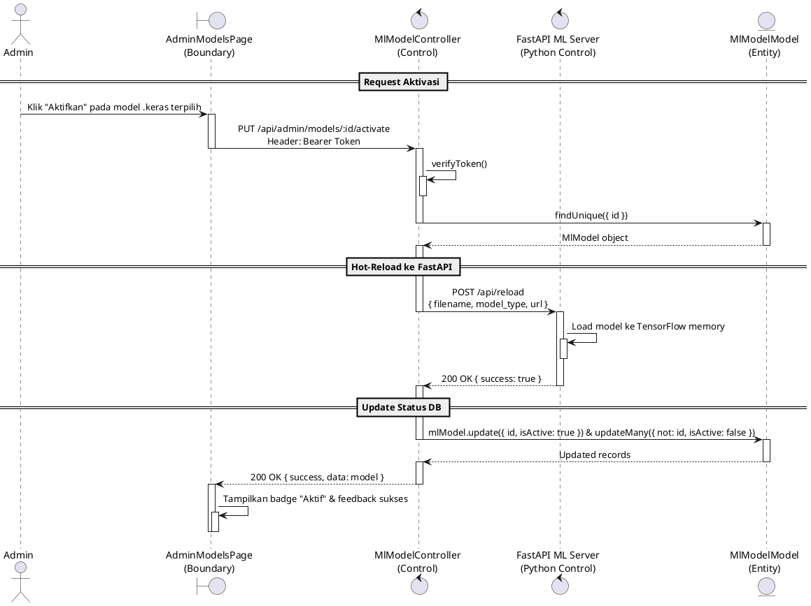
```plantuml
@startuml
skinparam sequenceMessageAlign center
skinparam responseMessageBelowArrow true

actor Admin

' === BOUNDARY ===
boundary "AdminModelsPage\n(Boundary)" as B

' === CONTROL ===
control "MlModelController\n(Control)" as C
control "FastAPI ML Server\n(Python Control)" as C_Py

' === ENTITY ===
entity "MlModelModel\n(Entity)" as E

== Request Aktivasi ==

Admin -> B : Klik "Aktifkan" pada model .keras terpilih
activate B

B -> C : PUT /api/admin/models/:id/activate\nHeader: Bearer Token
deactivate B
activate C

C -> C : verifyToken()
activate C
deactivate C

C -> E : findUnique({ id })
deactivate C
activate E

E --> C : MlModel object
deactivate E
activate C

== Hot-Reload ke FastAPI ==

C -> C_Py : POST /api/reload\n{ filename, model_type, url }
deactivate C
activate C_Py

C_Py -> C_Py : Load model ke TensorFlow memory
activate C_Py
deactivate C_Py

C_Py --> C : 200 OK { success: true }
deactivate C_Py
activate C

== Update Status DB ==

C -> E : mlModel.update({ id, isActive: true }) & updateMany({ not: id, isActive: false })
deactivate C
activate E

E --> C : Updated records
deactivate E
activate C

C --> B : 200 OK { success, data: model }
deactivate C
activate B

B -> B : Tampilkan badge "Aktif" & feedback sukses
activate B
deactivate B
deactivate B
@enduml
```

### BCE Sequence 10: Kelola Model ML — Hapus Model
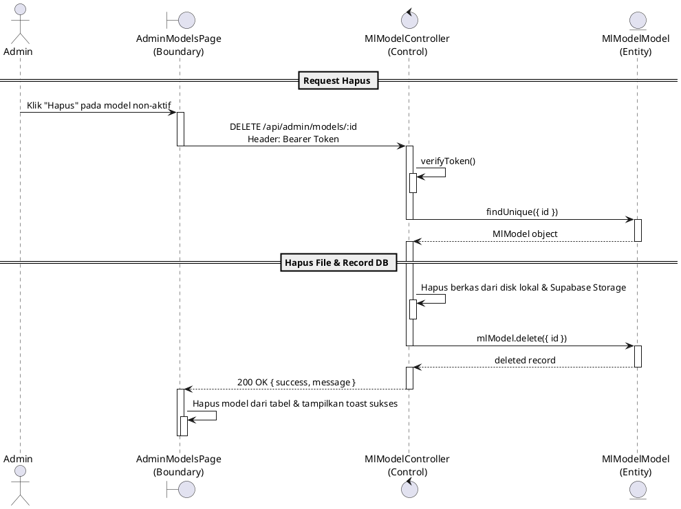
```plantuml
@startuml
skinparam sequenceMessageAlign center
skinparam responseMessageBelowArrow true

actor Admin

' === BOUNDARY ===
boundary "AdminModelsPage\n(Boundary)" as B

' === CONTROL ===
control "MlModelController\n(Control)" as C

' === ENTITY ===
entity "MlModelModel\n(Entity)" as E

== Request Hapus ==

Admin -> B : Klik "Hapus" pada model non-aktif
activate B

B -> C : DELETE /api/admin/models/:id\nHeader: Bearer Token
deactivate B
activate C

C -> C : verifyToken()
activate C
deactivate C

C -> E : findUnique({ id })
deactivate C
activate E

E --> C : MlModel object
deactivate E
activate C

== Hapus File & Record DB ==

C -> C : Hapus berkas dari disk lokal & Supabase Storage
activate C
deactivate C

C -> E : mlModel.delete({ id })
deactivate C
activate E

E --> C : deleted record
deactivate E
activate C

C --> B : 200 OK { success, message }
deactivate C
activate B

B -> B : Hapus model dari tabel & tampilkan toast sukses
activate B
deactivate B
deactivate B
@enduml
```

### BCE Sequence 11: ML Server Health Status Check
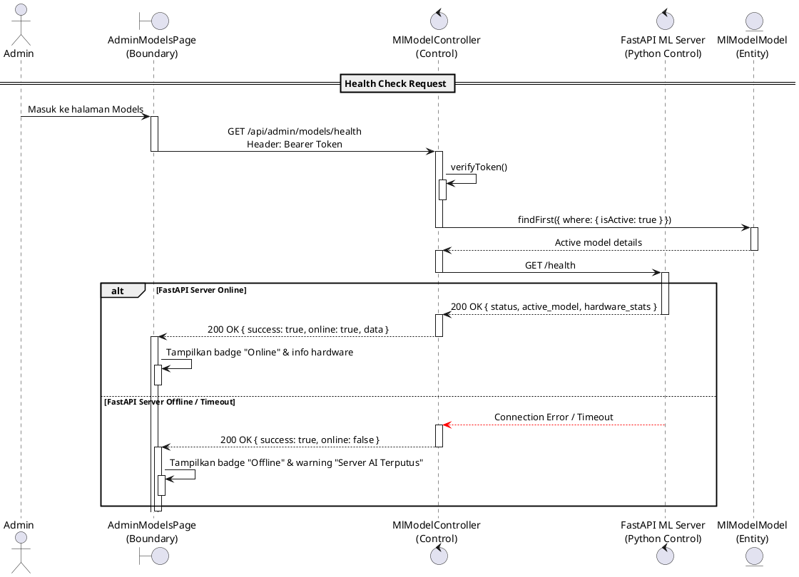
```plantuml
@startuml
skinparam sequenceMessageAlign center
skinparam responseMessageBelowArrow true

actor Admin

' === BOUNDARY ===
boundary "AdminModelsPage\n(Boundary)" as B

' === CONTROL ===
control "MlModelController\n(Control)" as C
control "FastAPI ML Server\n(Python Control)" as C_Py

' === ENTITY ===
entity "MlModelModel\n(Entity)" as E

== Health Check Request ==

Admin -> B : Masuk ke halaman Models
activate B

B -> C : GET /api/admin/models/health\nHeader: Bearer Token
deactivate B
activate C

C -> C : verifyToken()
activate C
deactivate C

C -> E : findFirst({ where: { isActive: true } })
deactivate C
activate E

E --> C : Active model details
deactivate E
activate C

C -> C_Py : GET /health
deactivate C
activate C_Py

alt FastAPI Server Online
  C_Py --> C : 200 OK { status, active_model, hardware_stats }
  deactivate C_Py
  activate C
  C --> B : 200 OK { success: true, online: true, data }
  deactivate C
  activate B
  B -> B : Tampilkan badge "Online" & info hardware
  activate B
  deactivate B
else FastAPI Server Offline / Timeout
  C_Py -[#red]-> C : Connection Error / Timeout
  deactivate C_Py
  activate C
  C --> B : 200 OK { success: true, online: false }
  deactivate C
  activate B
  B -> B : Tampilkan badge "Offline" & warning "Server AI Terputus"
  activate B
  deactivate B
end
deactivate B
@enduml
```

### BCE Sequence 12: Login User (Google OAuth)
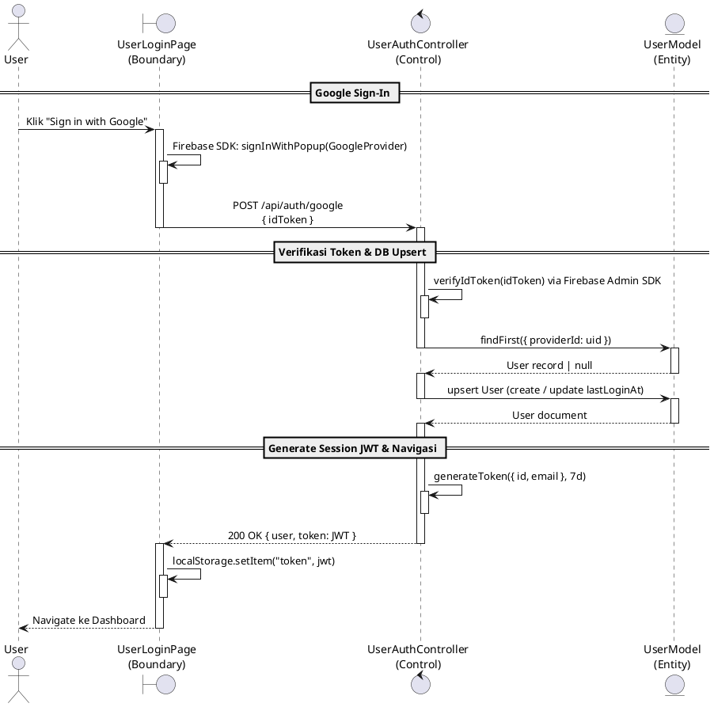
```plantuml
@startuml
skinparam sequenceMessageAlign center
skinparam responseMessageBelowArrow true

actor User

' === BOUNDARY ===
boundary "UserLoginPage\n(Boundary)" as B

' === CONTROL ===
control "UserAuthController\n(Control)" as C

' === ENTITY ===
entity "UserModel\n(Entity)" as E

== Google Sign-In ==

User -> B : Klik "Sign in with Google"
activate B

B -> B : Firebase SDK: signInWithPopup(GoogleProvider)
activate B
deactivate B

B -> C : POST /api/auth/google\n{ idToken }
deactivate B
activate C

== Verifikasi Token & DB Upsert ==

C -> C : verifyIdToken(idToken) via Firebase Admin SDK
activate C
deactivate C

C -> E : findFirst({ providerId: uid })
deactivate C
activate E

E --> C : User record | null
deactivate E
activate C

C -> E : upsert User (create / update lastLoginAt)
deactivate C
activate E

E --> C : User document
deactivate E
activate C

== Generate Session JWT & Navigasi ==

C -> C : generateToken({ id, email }, 7d)
activate C
deactivate C

C --> B : 200 OK { user, token: JWT }
deactivate C
activate B

B -> B : localStorage.setItem("token", jwt)
activate B
deactivate B

B --> User : Navigate ke Dashboard
deactivate B
@enduml
```
