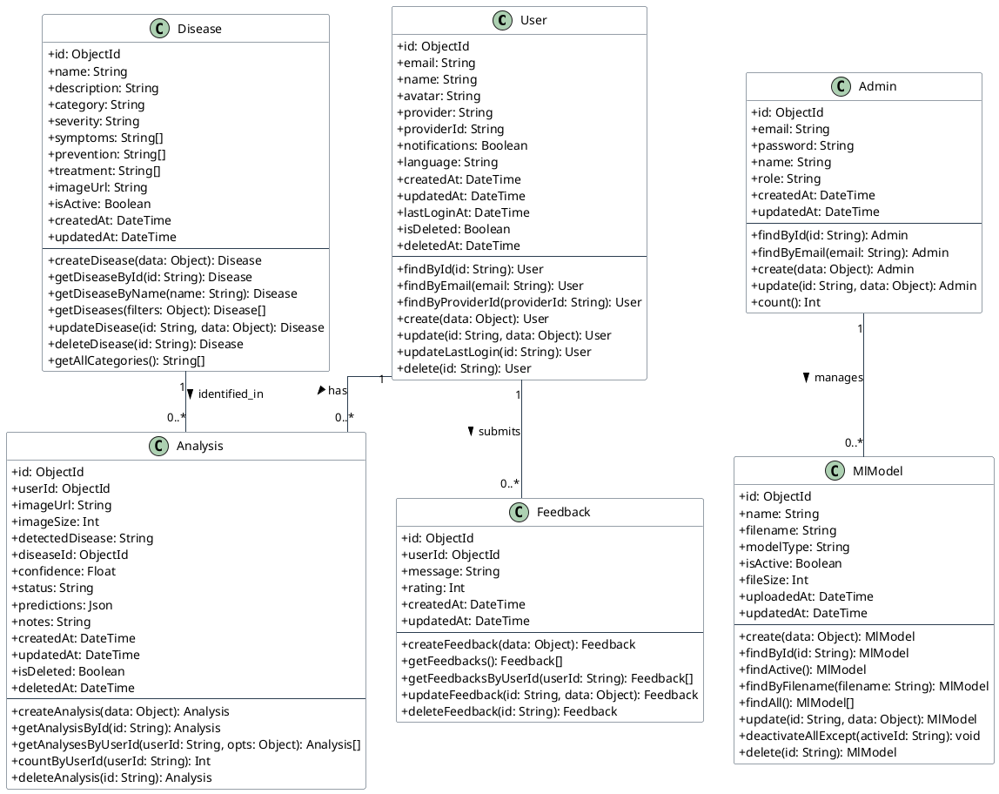

# Class Diagram — BananaVision v3.2 (Sederhana - Standar Skripsi)

Dokumen ini berisi rancangan **Class Diagram** untuk basis data (tabel/koleksi) sistem **BananaVision** yang disederhanakan agar mudah dipahami dan sesuai dengan standar skripsi umum (fokus pada nama tabel, atribut/field, operation/metode CRUD, dan relasi antar tabel).

---

## 1. Kode PlantUML Class Diagram (Sederhana)

---

## 2. Penjelasan Relasi & Multiplisitas

1. **User ke Analysis (1 to 0..\*)**
   * **Arti**: Satu pengguna (*User*) dapat memiliki banyak riwayat analisis daun pisang (*Analysis*), namun satu analisis hanya dimiliki oleh satu pengguna.
   * **Foreign Key**: Diwakili oleh kolom `userId` pada tabel `Analysis`.

2. **User ke Feedback (1 to 0..\*)**
   * **Arti**: Satu pengguna (*User*) dapat mengirimkan banyak masukan (*Feedback*), namun setiap ulasan feedback hanya ditulis oleh satu pengguna.
   * **Foreign Key**: Diwakili oleh kolom `userId` pada tabel `Feedback`.

3. **Disease ke Analysis (1 to 0..\*)**
   * **Arti**: Satu jenis penyakit (*Disease*) dapat terdeteksi di dalam banyak analisis gambar daun pisang, namun satu analisis yang berhasil hanya mengacu pada satu diagnosis penyakit (atau sehat).
   * **Foreign Key**: Diwakili oleh kolom `diseaseId` pada tabel `Analysis`.

4. **Admin ke MlModel (1 to 0..\*) - Relasi Konseptual**
   * **Arti**: Satu administrator (*Admin*) dapat mengelola (unggah, aktifkan, hapus) banyak model machine learning (*MlModel*).
   * **Keterangan**: Relasi ini bersifat konseptual di tingkat aplikasi. Di database fisik MongoDB, relasi ini tidak memiliki *Foreign Key* langsung.
