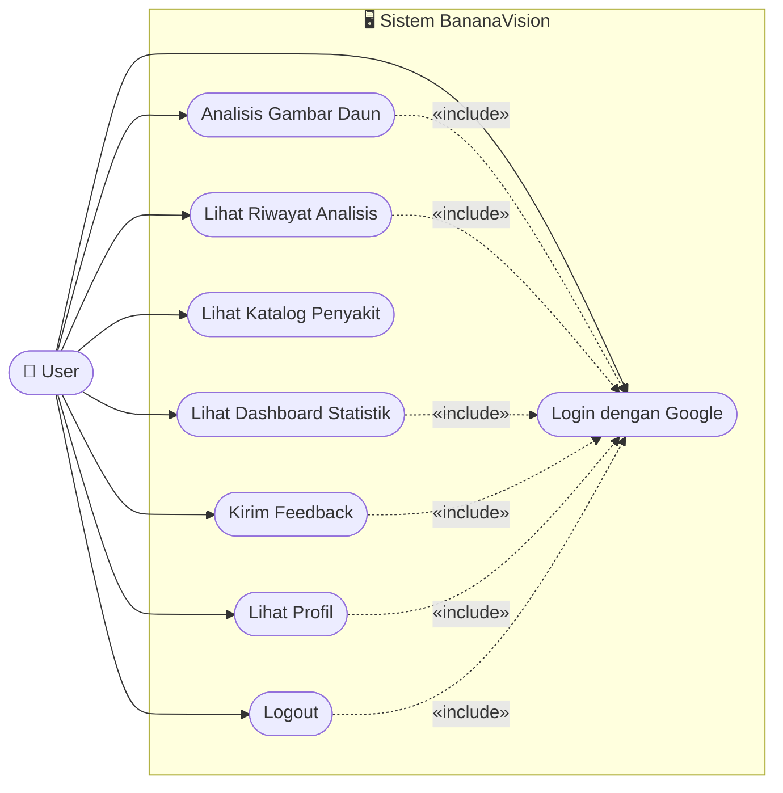
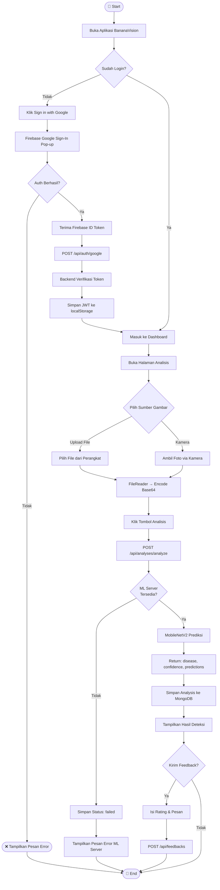
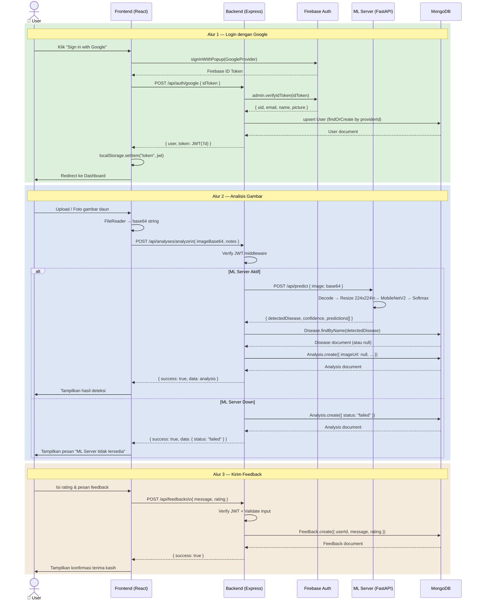
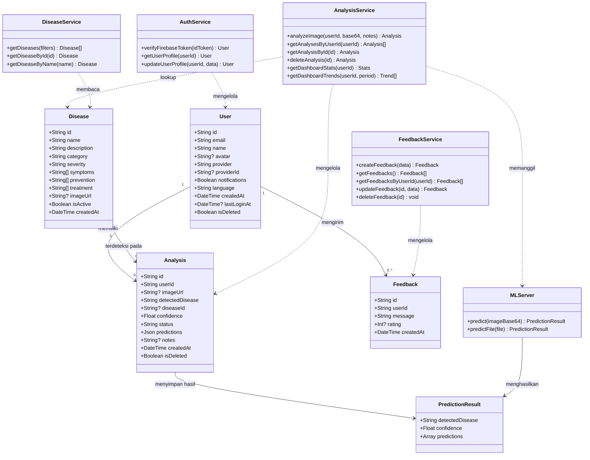

# UML Diagrams — BananaVision

Diagram untuk keperluan laporan tugas akhir. Dibuat menggunakan Mermaid.

---

## 1. Use Case Diagram

---

## 2. Activity Diagram — Analisis Gambar Daun

---

## 3. Sequence Diagram — Login & Analisis

---

## 4. Class Diagram

