# UML Diagrams — BananaVision v3.1

Semua diagram menggunakan sintaks **PlantUML**. Render di [plantuml.com](https://plantuml.com) atau IDE extension.

---

## 1. Use Case Diagram

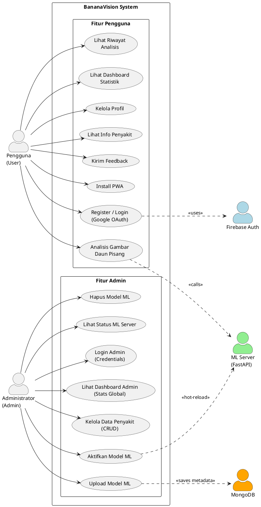
```plantuml
@startuml
left to right direction
skinparam packageStyle rectangle
skinparam actorStyle awesome

actor "Pengguna\n(User)" as User
actor "Administrator\n(Admin)" as Admin
actor "Firebase Auth" as Firebase #lightblue
actor "ML Server\n(FastAPI)" as ML #lightgreen
actor "MongoDB" as DB #orange

rectangle "BananaVision System" {

  rectangle "Fitur Pengguna" {
    usecase "Register / Login\n(Google OAuth)" as UC_Login
    usecase "Analisis Gambar\nDaun Pisang" as UC_Analyze
    usecase "Lihat Riwayat\nAnalisis" as UC_History
    usecase "Lihat Dashboard\nStatistik" as UC_Dashboard
    usecase "Kelola Profil" as UC_Profile
    usecase "Lihat Info Penyakit" as UC_Disease
    usecase "Kirim Feedback" as UC_Feedback
    usecase "Install PWA" as UC_PWA
  }

  rectangle "Fitur Admin" {
    usecase "Login Admin\n(Credentials)" as UC_AdminLogin
    usecase "Lihat Dashboard Admin\n(Stats Global)" as UC_AdminDash
    usecase "Kelola Data Penyakit\n(CRUD)" as UC_AdminDisease
    usecase "Upload Model ML" as UC_UploadModel
    usecase "Aktifkan Model ML" as UC_ActivateModel
    usecase "Hapus Model ML" as UC_DeleteModel
    usecase "Lihat Status ML Server" as UC_MLHealth
  }
}

' User interactions
User --> UC_Login
User --> UC_Analyze
User --> UC_History
User --> UC_Dashboard
User --> UC_Profile
User --> UC_Disease
User --> UC_Feedback
User --> UC_PWA

' Admin interactions
Admin --> UC_AdminLogin
Admin --> UC_AdminDash
Admin --> UC_AdminDisease
Admin --> UC_UploadModel
Admin --> UC_ActivateModel
Admin --> UC_DeleteModel
Admin --> UC_MLHealth

' External system dependencies
UC_Login ..> Firebase : <<uses>>
UC_Analyze ..> ML : <<calls>>
UC_ActivateModel ..> ML : <<hot-reload>>
UC_UploadModel ..> DB : <<saves metadata>>

@enduml
```

---

## 2. Class Diagram

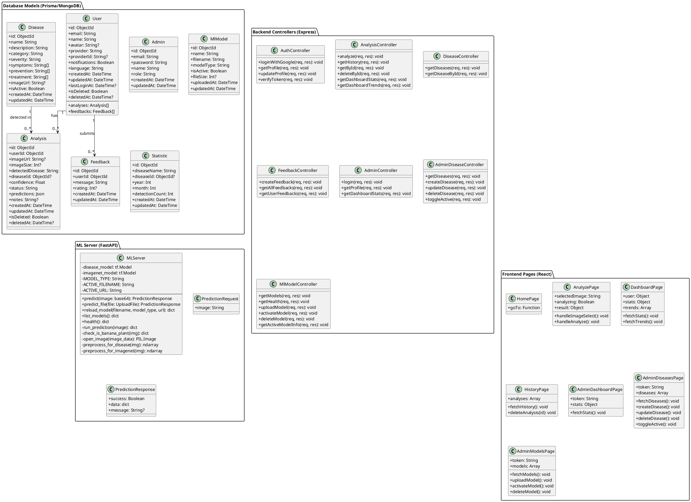
```plantuml
@startuml
skinparam classAttributeIconSize 0
skinparam linetype ortho

' ─── DATABASE MODELS ───────────────────────────────────────────
package "Database Models (Prisma/MongoDB)" {

  class User {
    +id: ObjectId
    +email: String
    +name: String
    +avatar: String?
    +provider: String
    +providerId: String?
    +notifications: Boolean
    +language: String
    +createdAt: DateTime
    +updatedAt: DateTime
    +lastLoginAt: DateTime?
    +isDeleted: Boolean
    +deletedAt: DateTime?
    ---
    +analyses: Analysis[]
    +feedbacks: Feedback[]
  }

  class Analysis {
    +id: ObjectId
    +userId: ObjectId
    +imageUrl: String?
    +imageSize: Int?
    +detectedDisease: String
    +diseaseId: ObjectId?
    +confidence: Float
    +status: String
    +predictions: Json
    +notes: String?
    +createdAt: DateTime
    +updatedAt: DateTime
    +isDeleted: Boolean
    +deletedAt: DateTime?
  }

  class Disease {
    +id: ObjectId
    +name: String
    +description: String
    +category: String
    +severity: String
    +symptoms: String[]
    +prevention: String[]
    +treatment: String[]
    +imageUrl: String?
    +isActive: Boolean
    +createdAt: DateTime
    +updatedAt: DateTime
  }

  class Feedback {
    +id: ObjectId
    +userId: ObjectId
    +message: String
    +rating: Int?
    +createdAt: DateTime
    +updatedAt: DateTime
  }

  class Admin {
    +id: ObjectId
    +email: String
    +password: String
    +name: String
    +role: String
    +createdAt: DateTime
    +updatedAt: DateTime
  }

  class MlModel {
    +id: ObjectId
    +name: String
    +filename: String
    +modelType: String
    +isActive: Boolean
    +fileSize: Int?
    +uploadedAt: DateTime
    +updatedAt: DateTime
  }

  class Statistic {
    +id: ObjectId
    +diseaseName: String
    +diseaseId: ObjectId?
    +year: Int
    +month: Int
    +detectionCount: Int
    +createdAt: DateTime
    +updatedAt: DateTime
  }
}

' ─── RELATIONSHIPS ───────────────────────────────────────────
User "1" --> "0..*" Analysis : has
User "1" --> "0..*" Feedback : submits
Disease "1" --> "0..*" Analysis : detected in

' ─── BACKEND CONTROLLERS ──────────────────────────────────────
package "Backend Controllers (Express)" {

  class AuthController {
    +loginWithGoogle(req, res): void
    +getProfile(req, res): void
    +updateProfile(req, res): void
    +verifyToken(req, res): void
  }

  class AnalysisController {
    +analyze(req, res): void
    +getHistory(req, res): void
    +getById(req, res): void
    +deleteById(req, res): void
    +getDashboardStats(req, res): void
    +getDashboardTrends(req, res): void
  }

  class DiseaseController {
    +getDiseases(req, res): void
    +getDiseaseById(req, res): void
  }

  class FeedbackController {
    +createFeedback(req, res): void
    +getAllFeedbacks(req, res): void
    +getUserFeedbacks(req, res): void
  }

  class AdminController {
    +login(req, res): void
    +getProfile(req, res): void
    +getDashboardStats(req, res): void
  }

  class AdminDiseaseController {
    +getDiseases(req, res): void
    +createDisease(req, res): void
    +updateDisease(req, res): void
    +deleteDisease(req, res): void
    +toggleActive(req, res): void
  }

  class MlModelController {
    +getModels(req, res): void
    +getHealth(req, res): void
    +uploadModel(req, res): void
    +activateModel(req, res): void
    +deleteModel(req, res): void
    +getActiveModelInfo(req, res): void
  }
}

' ─── ML SERVER ───────────────────────────────────────────────
package "ML Server (FastAPI)" {

  class MLServer {
    -disease_model: tf.Model
    -imagenet_model: tf.Model
    -MODEL_TYPE: String
    -ACTIVE_FILENAME: String
    -ACTIVE_URL: String
    ---
    +predict(image: base64): PredictionResponse
    +predict_file(file: UploadFile): PredictionResponse
    +reload_model(filename, model_type, url): dict
    +list_models(): dict
    +health(): dict
    -run_prediction(image): dict
    -check_is_banana_plant(img): dict
    -open_image(image_data): PIL.Image
    -preprocess_for_disease(img): ndarray
    -preprocess_for_imagenet(img): ndarray
  }

  class PredictionRequest {
    +image: String
  }

  class PredictionResponse {
    +success: Boolean
    +data: dict
    +message: String?
  }
}

' ─── FRONTEND PAGES ─────────────────────────────────────────
package "Frontend Pages (React)" {

  class HomePage {
    +goTo: Function
  }

  class AnalyzePage {
    +selectedImage: String
    +analyzing: Boolean
    +result: Object
    +handleImageSelect(): void
    +handleAnalyze(): void
  }

  class DashboardPage {
    +user: Object
    +stats: Object
    +trends: Array
    +fetchStats(): void
    +fetchTrends(): void
  }

  class HistoryPage {
    +analyses: Array
    +fetchHistory(): void
    +deleteAnalysis(id): void
  }

  class AdminDashboardPage {
    +token: String
    +stats: Object
    +fetchStats(): void
  }

  class AdminDiseasesPage {
    +token: String
    +diseases: Array
    +fetchDiseases(): void
    +createDisease(): void
    +updateDisease(): void
    +deleteDisease(): void
    +toggleActive(): void
  }

  class AdminModelsPage {
    +token: String
    +models: Array
    +fetchModels(): void
    +uploadModel(): void
    +activateModel(): void
    +deleteModel(): void
  }
}

@enduml
```

---

## 3. Sequence Diagram — User Login (Google OAuth)

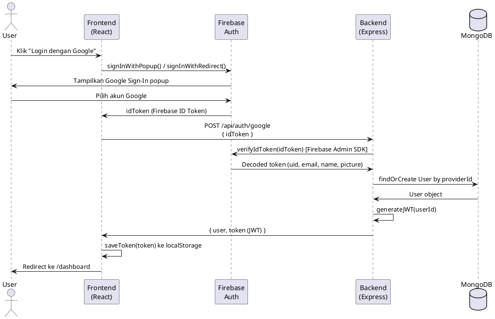
```plantuml
@startuml
skinparam sequenceMessageAlign center
skinparam responseMessageBelowArrow true

actor User
participant "Frontend\n(React)" as FE
participant "Firebase\nAuth" as FB
participant "Backend\n(Express)" as BE
database "MongoDB" as DB

User -> FE : Klik "Login dengan Google"
FE -> FB : signInWithPopup() / signInWithRedirect()
FB -> User : Tampilkan Google Sign-In popup
User -> FB : Pilih akun Google
FB -> FE : idToken (Firebase ID Token)
FE -> BE : POST /api/auth/google\n{ idToken }
BE -> FB : verifyIdToken(idToken) [Firebase Admin SDK]
FB -> BE : Decoded token (uid, email, name, picture)
BE -> DB : findOrCreate User by providerId
DB -> BE : User object
BE -> BE : generateJWT(userId)
BE -> FE : { user, token (JWT) }
FE -> FE : saveToken(token) ke localStorage
FE -> User : Redirect ke /dashboard

@enduml
```

---

## 4. Sequence Diagram — Image Analysis (Two-Pass ML)

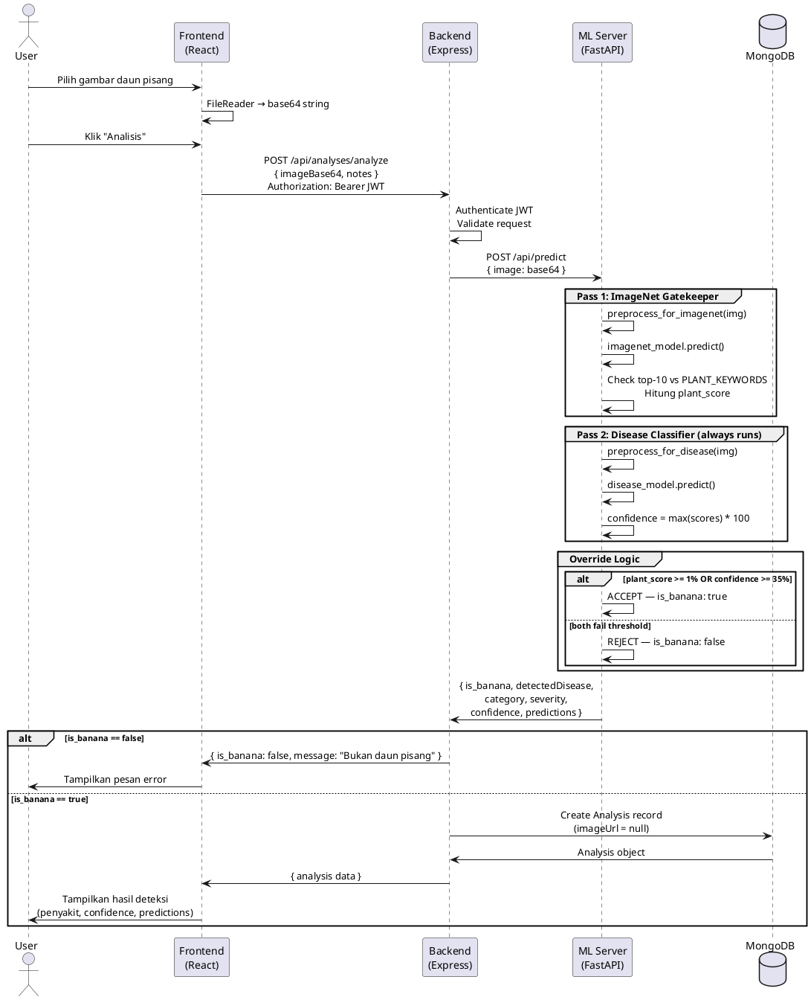
```plantuml
@startuml
skinparam sequenceMessageAlign center
skinparam responseMessageBelowArrow true

actor User
participant "Frontend\n(React)" as FE
participant "Backend\n(Express)" as BE
participant "ML Server\n(FastAPI)" as ML
database "MongoDB" as DB

User -> FE : Pilih gambar daun pisang
FE -> FE : FileReader → base64 string
User -> FE : Klik "Analisis"
FE -> BE : POST /api/analyses/analyze\n{ imageBase64, notes }\nAuthorization: Bearer JWT
BE -> BE : Authenticate JWT\nValidate request

BE -> ML : POST /api/predict\n{ image: base64 }

group Pass 1: ImageNet Gatekeeper
  ML -> ML : preprocess_for_imagenet(img)
  ML -> ML : imagenet_model.predict()
  ML -> ML : Check top-10 vs PLANT_KEYWORDS\nHitung plant_score
end

group Pass 2: Disease Classifier (always runs)
  ML -> ML : preprocess_for_disease(img)
  ML -> ML : disease_model.predict()
  ML -> ML : confidence = max(scores) * 100
end

group Override Logic
  alt plant_score >= 1% OR confidence >= 35%
    ML -> ML : ACCEPT — is_banana: true
  else both fail threshold
    ML -> ML : REJECT — is_banana: false
  end
end

ML -> BE : { is_banana, detectedDisease,\ncategory, severity,\nconfidence, predictions }

alt is_banana == false
  BE -> FE : { is_banana: false, message: "Bukan daun pisang" }
  FE -> User : Tampilkan pesan error
else is_banana == true
  BE -> DB : Create Analysis record\n(imageUrl = null)
  DB -> BE : Analysis object
  BE -> FE : { analysis data }
  FE -> User : Tampilkan hasil deteksi\n(penyakit, confidence, predictions)
end

@enduml
```

---

## 5. Sequence Diagram — Admin Login

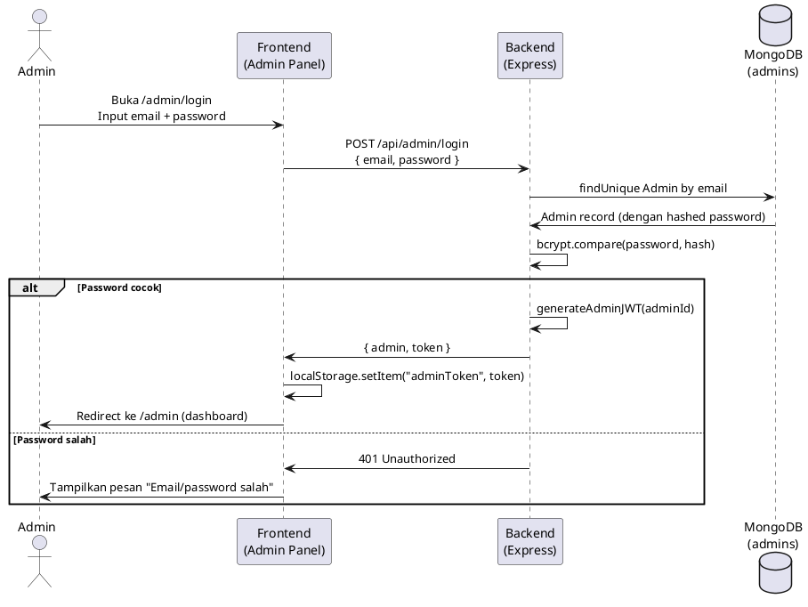
```plantuml
@startuml
skinparam sequenceMessageAlign center

actor Admin
participant "Frontend\n(Admin Panel)" as FE
participant "Backend\n(Express)" as BE
database "MongoDB\n(admins)" as DB

Admin -> FE : Buka /admin/login\nInput email + password
FE -> BE : POST /api/admin/login\n{ email, password }
BE -> DB : findUnique Admin by email
DB -> BE : Admin record (dengan hashed password)
BE -> BE : bcrypt.compare(password, hash)

alt Password cocok
  BE -> BE : generateAdminJWT(adminId)
  BE -> FE : { admin, token }
  FE -> FE : localStorage.setItem("adminToken", token)
  FE -> Admin : Redirect ke /admin (dashboard)
else Password salah
  BE -> FE : 401 Unauthorized
  FE -> Admin : Tampilkan pesan "Email/password salah"
end

@enduml
```

---

## 6. Sequence Diagram — ML Model Management (Upload & Aktivasi)

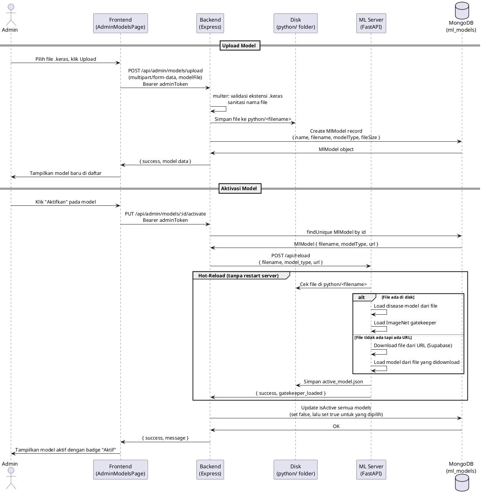
```plantuml
@startuml
skinparam sequenceMessageAlign center

actor Admin
participant "Frontend\n(AdminModelsPage)" as FE
participant "Backend\n(Express)" as BE
participant "Disk\n(python/ folder)" as DISK
participant "ML Server\n(FastAPI)" as ML
database "MongoDB\n(ml_models)" as DB

== Upload Model ==

Admin -> FE : Pilih file .keras, klik Upload
FE -> BE : POST /api/admin/models/upload\n(multipart/form-data, modelFile)\nBearer adminToken
BE -> BE : multer: validasi ekstensi .keras\nsanitasi nama file
BE -> DISK : Simpan file ke python/<filename>
BE -> DB : Create MlModel record\n{ name, filename, modelType, fileSize }
DB -> BE : MlModel object
BE -> FE : { success, model data }
FE -> Admin : Tampilkan model baru di daftar

== Aktivasi Model ==

Admin -> FE : Klik "Aktifkan" pada model
FE -> BE : PUT /api/admin/models/:id/activate\nBearer adminToken
BE -> DB : findUnique MlModel by id
DB -> BE : MlModel { filename, modelType, url }
BE -> ML : POST /api/reload\n{ filename, model_type, url }

group Hot-Reload (tanpa restart server)
  ML -> DISK : Cek file di python/<filename>
  alt File ada di disk
    ML -> ML : Load disease model dari file
    ML -> ML : Load ImageNet gatekeeper
  else File tidak ada tapi ada URL
    ML -> ML : Download file dari URL (Supabase)
    ML -> ML : Load model dari file yang didownload
  end
  ML -> DISK : Simpan active_model.json
  ML -> BE : { success, gatekeeper_loaded }
end

BE -> DB : Update isActive semua models\n(set false, lalu set true untuk yang dipilih)
DB -> BE : OK
BE -> FE : { success, message }
FE -> Admin : Tampilkan model aktif dengan badge "Aktif"

@enduml
```

---

## 7. Sequence Diagram — Auto-Recovery ML Server (Restart)

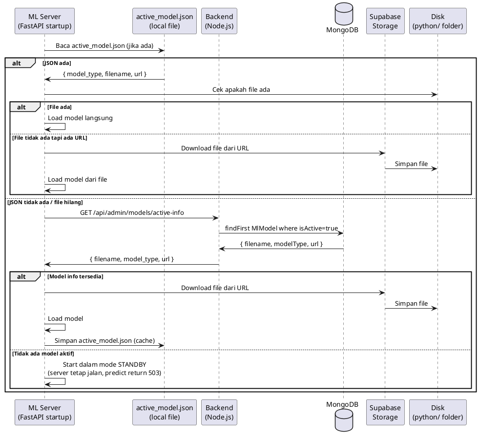
```plantuml
@startuml
skinparam sequenceMessageAlign center

participant "ML Server\n(FastAPI startup)" as ML
participant "active_model.json\n(local file)" as JSON
participant "Backend\n(Node.js)" as BE
database "MongoDB" as DB
participant "Supabase\nStorage" as STORAGE
participant "Disk\n(python/ folder)" as DISK

ML -> JSON : Baca active_model.json (jika ada)
alt JSON ada
  JSON -> ML : { model_type, filename, url }
  ML -> DISK : Cek apakah file ada
  alt File ada
    ML -> ML : Load model langsung
  else File tidak ada tapi ada URL
    ML -> STORAGE : Download file dari URL
    STORAGE -> DISK : Simpan file
    ML -> ML : Load model dari file
  end
else JSON tidak ada / file hilang
  ML -> BE : GET /api/admin/models/active-info
  BE -> DB : findFirst MlModel where isActive=true
  DB -> BE : { filename, modelType, url }
  BE -> ML : { filename, model_type, url }
  alt Model info tersedia
    ML -> STORAGE : Download file dari URL
    STORAGE -> DISK : Simpan file
    ML -> ML : Load model
    ML -> JSON : Simpan active_model.json (cache)
  else Tidak ada model aktif
    ML -> ML : Start dalam mode STANDBY\n(server tetap jalan, predict return 503)
  end
end

@enduml
```

---

## 8. Activity Diagram — Alur Analisis Gambar

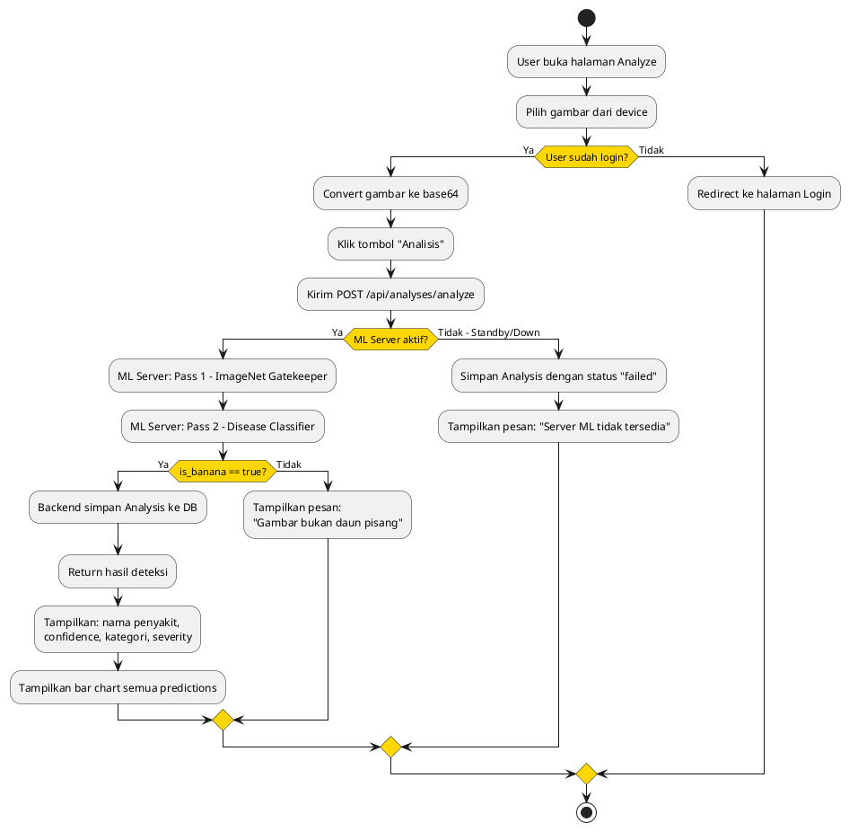
```plantuml
@startuml
skinparam activityDiamondBackgroundColor #FFD700
start

:User buka halaman Analyze;
:Pilih gambar dari device;

if (User sudah login?) then (Ya)
  :Convert gambar ke base64;
  :Klik tombol "Analisis";
  :Kirim POST /api/analyses/analyze;

  if (ML Server aktif?) then (Ya)
    :ML Server: Pass 1 - ImageNet Gatekeeper;
    :ML Server: Pass 2 - Disease Classifier;

    if (is_banana == true?) then (Ya)
      :Backend simpan Analysis ke DB;
      :Return hasil deteksi;
      :Tampilkan: nama penyakit,\nconfidence, kategori, severity;
      :Tampilkan bar chart semua predictions;
    else (Tidak)
      :Tampilkan pesan:\n"Gambar bukan daun pisang";
    end if
  else (Tidak - Standby/Down)
    :Simpan Analysis dengan status "failed";
    :Tampilkan pesan: "Server ML tidak tersedia";
  end if
else (Tidak)
  :Redirect ke halaman Login;
end if

stop
@enduml
```

---

## 9. Activity Diagram — Admin Kelola Model ML

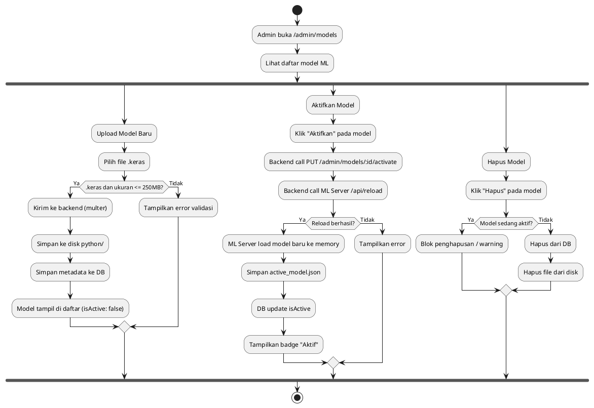
```plantuml
@startuml
start

:Admin buka /admin/models;
:Lihat daftar model ML;

fork
  :Upload Model Baru;
  :Pilih file .keras;
  if (.keras dan ukuran <= 250MB?) then (Ya)
    :Kirim ke backend (multer);
    :Simpan ke disk python/;
    :Simpan metadata ke DB;
    :Model tampil di daftar (isActive: false);
  else (Tidak)
    :Tampilkan error validasi;
  end if

fork again
  :Aktifkan Model;
  :Klik "Aktifkan" pada model;
  :Backend call PUT /admin/models/:id/activate;
  :Backend call ML Server /api/reload;
  if (Reload berhasil?) then (Ya)
    :ML Server load model baru ke memory;
    :Simpan active_model.json;
    :DB update isActive;
    :Tampilkan badge "Aktif";
  else (Tidak)
    :Tampilkan error;
  end if

fork again
  :Hapus Model;
  :Klik "Hapus" pada model;
  if (Model sedang aktif?) then (Ya)
    :Blok penghapusan / warning;
  else (Tidak)
    :Hapus dari DB;
    :Hapus file dari disk;
  end if
end fork

stop
@enduml
```

---

## 10. Component Diagram — Arsitektur Sistem

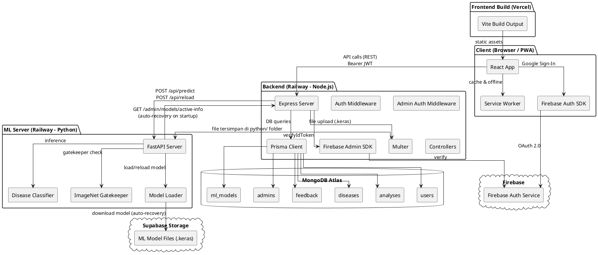
```plantuml
@startuml
skinparam componentStyle rectangle
skinparam linetype ortho

package "Client (Browser / PWA)" {
  [React App] as ReactApp
  [Service Worker] as SW
  [Firebase Auth SDK] as FirebaseSDK
}

package "Frontend Build (Vercel)" {
  [Vite Build Output] as ViteBuild
}

package "Backend (Railway - Node.js)" {
  [Express Server] as Express
  [Auth Middleware] as AuthMW
  [Admin Auth Middleware] as AdminMW
  [Controllers] as Controllers
  [Prisma Client] as Prisma
  [Firebase Admin SDK] as FirebaseAdmin
  [Multer] as Multer
}

package "ML Server (Railway - Python)" {
  [FastAPI Server] as FastAPI
  [Disease Classifier] as DiseaseModel
  [ImageNet Gatekeeper] as ImageNetGK
  [Model Loader] as ModelLoader
}

database "MongoDB Atlas" {
  [users]
  [analyses]
  [diseases]
  [feedback]
  [admins]
  [ml_models]
}

cloud "Firebase" {
  [Firebase Auth Service] as FirebaseService
}

cloud "Supabase Storage" {
  [ML Model Files (.keras)] as SupabaseFiles
}

ReactApp --> Express : API calls (REST)\nBearer JWT
ReactApp --> FirebaseSDK : Google Sign-In
FirebaseSDK --> FirebaseService : OAuth 2.0
Express --> FirebaseAdmin : verifyIdToken
FirebaseAdmin --> FirebaseService : verify
Express --> Prisma : DB queries
Prisma --> [users]
Prisma --> [analyses]
Prisma --> [diseases]
Prisma --> [feedback]
Prisma --> [admins]
Prisma --> [ml_models]
Express --> FastAPI : POST /api/predict\nPOST /api/reload
Express --> Multer : file upload (.keras)
Multer --> FastAPI : file tersimpan di python/ folder
FastAPI --> DiseaseModel : inference
FastAPI --> ImageNetGK : gatekeeper check
FastAPI --> ModelLoader : load/reload model
ModelLoader --> SupabaseFiles : download model (auto-recovery)
ReactApp --> SW : cache & offline
ViteBuild --> ReactApp : static assets
FastAPI --> Express : GET /admin/models/active-info\n(auto-recovery on startup)

@enduml
```

---

## 11. Swimlane Activity Diagram — Analisis Gambar Daun Pisang

> Diagram ini menunjukkan alur kerja antara User, Frontend, Backend, dan ML Server secara paralel (swimlane).

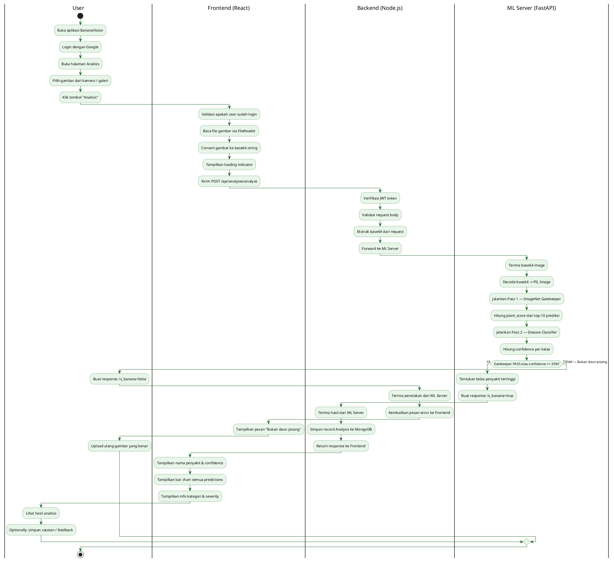
```plantuml
@startuml
skinparam ActivityBorderColor #2E7D32
skinparam ActivityBackgroundColor #E8F5E9
skinparam ArrowColor #1B5E20

|User|
start
:Buka aplikasi BananaVision;
:Login dengan Google;
:Buka halaman Analisis;
:Pilih gambar dari kamera / galeri;
:Klik tombol "Analisis";

|Frontend (React)|
:Validasi apakah user sudah login;
:Baca file gambar via FileReader;
:Convert gambar ke base64 string;
:Tampilkan loading indicator;
:Kirim POST /api/analyses/analyze;

|Backend (Node.js)|
:Verifikasi JWT token;
:Validasi request body;
:Ekstrak base64 dari request;
:Forward ke ML Server;

|ML Server (FastAPI)|
:Terima base64 image;
:Decode base64 → PIL Image;
:Jalankan Pass 1 — ImageNet Gatekeeper;
:Hitung plant_score dari top-10 prediksi;
:Jalankan Pass 2 — Disease Classifier;
:Hitung confidence per kelas;

if (Gatekeeper PASS atau confidence >= 35%?) then (YA)
  :Tentukan kelas penyakit tertinggi;
  :Buat response: is_banana=true;
  |Backend (Node.js)|
  :Terima hasil dari ML Server;
  :Simpan record Analysis ke MongoDB;
  :Return response ke Frontend;
  |Frontend (React)|
  :Tampilkan nama penyakit & confidence;
  :Tampilkan bar chart semua predictions;
  :Tampilkan info kategori & severity;
  |User|
  :Lihat hasil analisis;
  :Optionally: simpan catatan / feedback;
else (TIDAK — Bukan daun pisang)
  :Buat response: is_banana=false;
  |Backend (Node.js)|
  :Terima penolakan dari ML Server;
  :Kembalikan pesan error ke Frontend;
  |Frontend (React)|
  :Tampilkan pesan "Bukan daun pisang";
  |User|
  :Upload ulang gambar yang benar;
end if

stop
@enduml
```

---

## 12. Swimlane Activity Diagram — Manajemen Model ML (Admin)

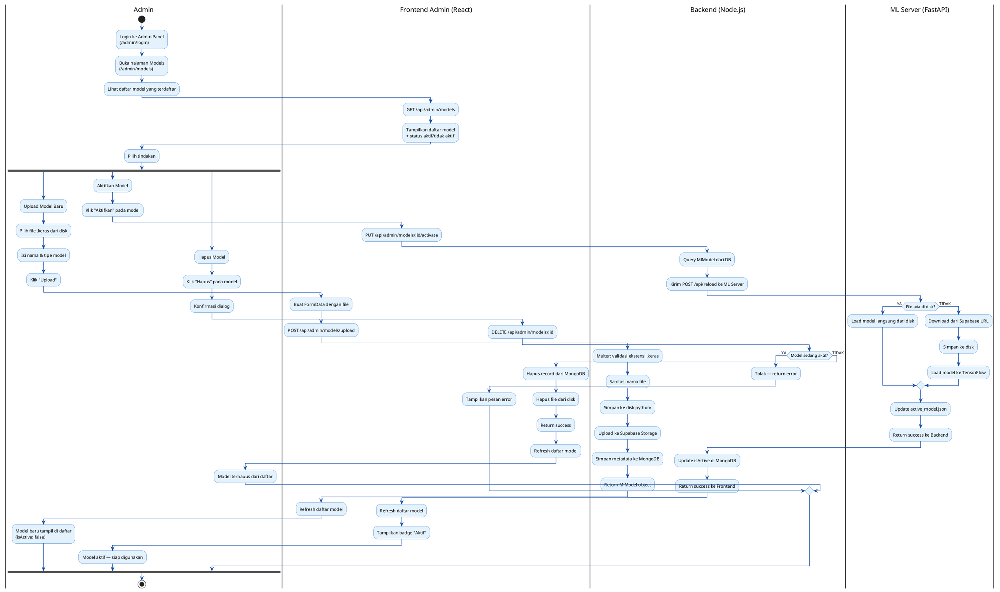
```plantuml
@startuml
skinparam ActivityBorderColor #1565C0
skinparam ActivityBackgroundColor #E3F2FD
skinparam ArrowColor #0D47A1

|Admin|
start
:Login ke Admin Panel\n(/admin/login);
:Buka halaman Models\n(/admin/models);
:Lihat daftar model yang terdaftar;

|Frontend Admin (React)|
:GET /api/admin/models;
:Tampilkan daftar model\n+ status aktif/tidak aktif;

|Admin|
:Pilih tindakan;

fork
  :Upload Model Baru;
  |Admin|
  :Pilih file .keras dari disk;
  :Isi nama & tipe model;
  :Klik "Upload";

  |Frontend Admin (React)|
  :Buat FormData dengan file;
  :POST /api/admin/models/upload;

  |Backend (Node.js)|
  :Multer: validasi ekstensi .keras;
  :Sanitasi nama file;
  :Simpan ke disk python/;
  :Upload ke Supabase Storage;
  :Simpan metadata ke MongoDB;
  :Return MlModel object;

  |Frontend Admin (React)|
  :Refresh daftar model;

  |Admin|
  :Model baru tampil di daftar\n(isActive: false);

fork again
  :Aktifkan Model;
  |Admin|
  :Klik "Aktifkan" pada model;

  |Frontend Admin (React)|
  :PUT /api/admin/models/:id/activate;

  |Backend (Node.js)|
  :Query MlModel dari DB;
  :Kirim POST /api/reload ke ML Server;

  |ML Server (FastAPI)|
  if (File ada di disk?) then (YA)
    :Load model langsung dari disk;
  else (TIDAK)
    :Download dari Supabase URL;
    :Simpan ke disk;
    :Load model ke TensorFlow;
  end if
  :Update active_model.json;
  :Return success ke Backend;

  |Backend (Node.js)|
  :Update isActive di MongoDB;
  :Return success ke Frontend;

  |Frontend Admin (React)|
  :Refresh daftar model;
  :Tampilkan badge "Aktif";

  |Admin|
  :Model aktif — siap digunakan;

fork again
  :Hapus Model;
  |Admin|
  :Klik "Hapus" pada model;
  :Konfirmasi dialog;

  |Frontend Admin (React)|
  :DELETE /api/admin/models/:id;

  |Backend (Node.js)|
  if (Model sedang aktif?) then (YA)
    :Tolak — return error;
    |Frontend Admin (React)|
    :Tampilkan pesan error;
  else (TIDAK)
    :Hapus record dari MongoDB;
    :Hapus file dari disk;
    :Return success;
    |Frontend Admin (React)|
    :Refresh daftar model;
    |Admin|
    :Model terhapus dari daftar;
  end if
end fork

stop
@enduml
```

---

## 13. BCE Sequence Diagram — Analisis Gambar (Boundary-Control-Entity)

> BCE (Boundary-Control-Entity) adalah pola arsitektur yang memisahkan komponen UI, logika, dan data. Diagram ini menunjukkan alur analisis menggunakan pola tersebut.

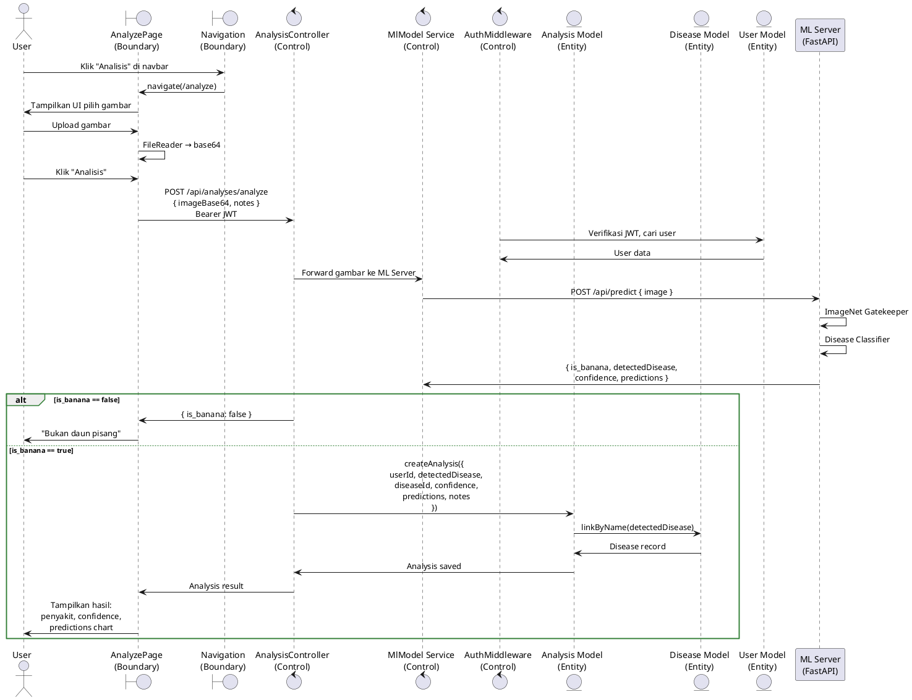
```plantuml
@startuml
skinparam sequenceMessageAlign center
skinparam responseMessageBelowArrow true
skinparam SequenceGroupBorderColor #2E7D32

actor User

' === BOUNDARY (UI) ===
boundary "AnalyzePage\n(Boundary)" as B_Analyze
boundary "Navigation\n(Boundary)" as B_Nav

' === CONTROL (Business Logic) ===
control "AnalysisController\n(Control)" as C_Analysis
control "MlModel Service\n(Control)" as C_ML
control "AuthMiddleware\n(Control)" as C_Auth

' === ENTITY (Data) ===
entity "Analysis Model\n(Entity)" as E_Analysis
entity "Disease Model\n(Entity)" as E_Disease
entity "User Model\n(Entity)" as E_User

' === External ===
participant "ML Server\n(FastAPI)" as ML

User -> B_Nav : Klik "Analisis" di navbar
B_Nav -> B_Analyze : navigate(/analyze)
B_Analyze -> User : Tampilkan UI pilih gambar

User -> B_Analyze : Upload gambar
B_Analyze -> B_Analyze : FileReader → base64

User -> B_Analyze : Klik "Analisis"
B_Analyze -> C_Analysis : POST /api/analyses/analyze\n{ imageBase64, notes }\nBearer JWT

C_Auth -> E_User : Verifikasi JWT, cari user
E_User -> C_Auth : User data

C_Analysis -> C_ML : Forward gambar ke ML Server

C_ML -> ML : POST /api/predict { image }
ML -> ML : ImageNet Gatekeeper
ML -> ML : Disease Classifier
ML -> C_ML : { is_banana, detectedDisease,\nconfidence, predictions }

alt is_banana == false
  C_Analysis -> B_Analyze : { is_banana: false }
  B_Analyze -> User : "Bukan daun pisang"
else is_banana == true
  C_Analysis -> E_Analysis : createAnalysis({\n  userId, detectedDisease,\n  diseaseId, confidence,\n  predictions, notes\n})
  E_Analysis -> E_Disease : linkByName(detectedDisease)
  E_Disease -> E_Analysis : Disease record
  E_Analysis -> C_Analysis : Analysis saved
  C_Analysis -> B_Analyze : Analysis result
  B_Analyze -> User : Tampilkan hasil:\npenyakit, confidence,\npredictions chart
end

@enduml
```

---

## 14. BCE Sequence Diagram — Autentikasi Pengguna

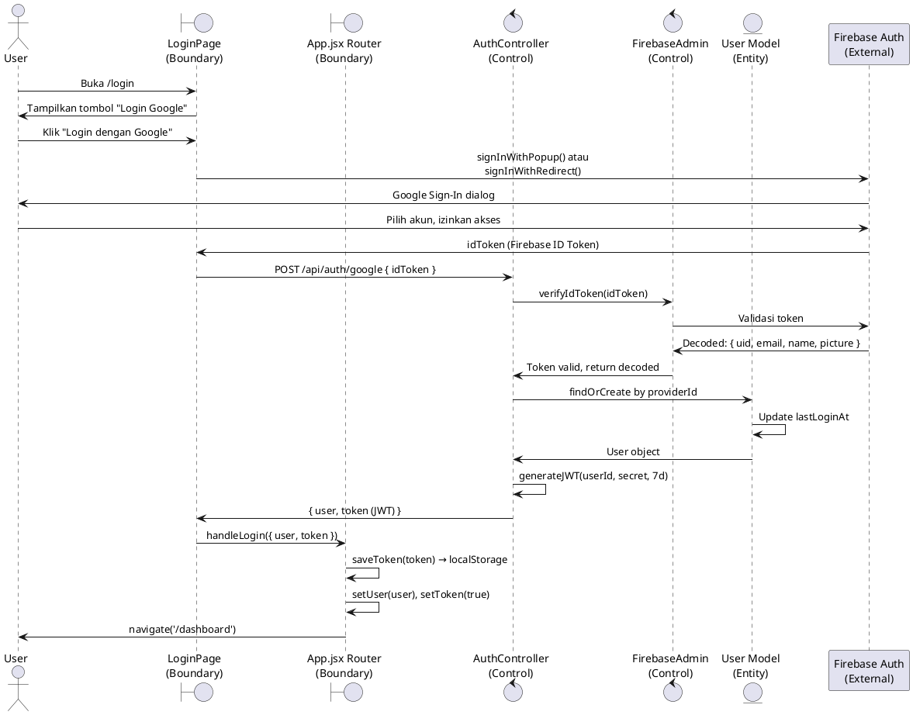
```plantuml
@startuml
skinparam sequenceMessageAlign center
skinparam responseMessageBelowArrow true

actor User

' === BOUNDARY ===
boundary "LoginPage\n(Boundary)" as B_Login
boundary "App.jsx Router\n(Boundary)" as B_App

' === CONTROL ===
control "AuthController\n(Control)" as C_Auth
control "FirebaseAdmin\n(Control)" as C_Firebase

' === ENTITY ===
entity "User Model\n(Entity)" as E_User

' === External ===
participant "Firebase Auth\n(External)" as FB

User -> B_Login : Buka /login
B_Login -> User : Tampilkan tombol "Login Google"

User -> B_Login : Klik "Login dengan Google"
B_Login -> FB : signInWithPopup() atau\nsignInWithRedirect()
FB -> User : Google Sign-In dialog
User -> FB : Pilih akun, izinkan akses
FB -> B_Login : idToken (Firebase ID Token)

B_Login -> C_Auth : POST /api/auth/google { idToken }
C_Auth -> C_Firebase : verifyIdToken(idToken)
C_Firebase -> FB : Validasi token
FB -> C_Firebase : Decoded: { uid, email, name, picture }
C_Firebase -> C_Auth : Token valid, return decoded

C_Auth -> E_User : findOrCreate by providerId
E_User -> E_User : Update lastLoginAt
E_User -> C_Auth : User object

C_Auth -> C_Auth : generateJWT(userId, secret, 7d)
C_Auth -> B_Login : { user, token (JWT) }

B_Login -> B_App : handleLogin({ user, token })
B_App -> B_App : saveToken(token) → localStorage
B_App -> B_App : setUser(user), setToken(true)
B_App -> User : navigate('/dashboard')

@enduml
```

---

## 15. State Diagram — Status Analisis

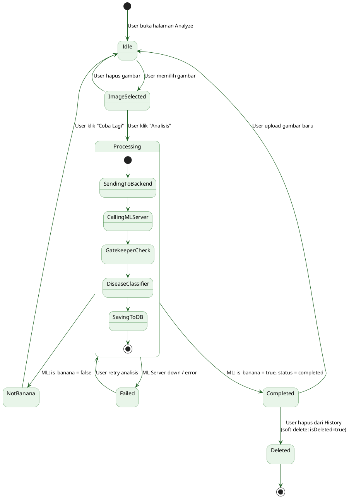
```plantuml
@startuml
skinparam StateBackgroundColor #E8F5E9
skinparam StateBorderColor #2E7D32
skinparam ArrowColor #1B5E20

[*] --> Idle : User buka halaman Analyze

Idle --> ImageSelected : User memilih gambar
ImageSelected --> Idle : User hapus gambar

ImageSelected --> Processing : User klik "Analisis"

Processing --> NotBanana : ML: is_banana = false
Processing --> Completed : ML: is_banana = true, status = completed
Processing --> Failed : ML Server down / error

NotBanana --> Idle : User klik "Coba Lagi"
Completed --> Idle : User upload gambar baru
Failed --> Processing : User retry analisis

Completed --> Deleted : User hapus dari History\n(soft delete: isDeleted=true)
Deleted --> [*]

state Processing {
  [*] --> SendingToBackend
  SendingToBackend --> CallingMLServer
  CallingMLServer --> GatekeeperCheck
  GatekeeperCheck --> DiseaseClassifier
  DiseaseClassifier --> SavingToDB
  SavingToDB --> [*]
}

@enduml
```

---

## 16. State Diagram — Status Model ML

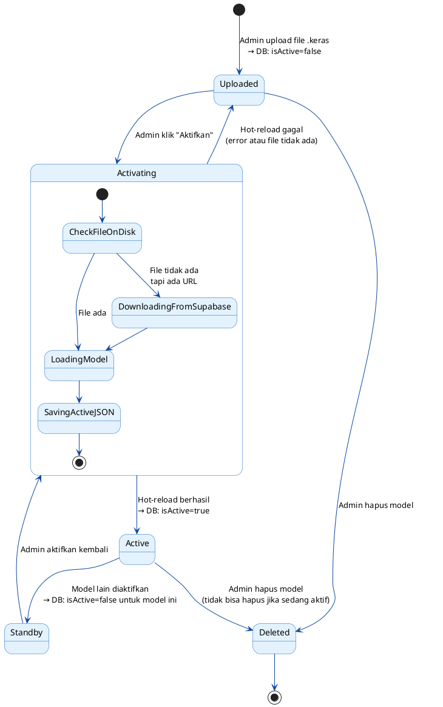
```plantuml
@startuml
skinparam StateBackgroundColor #E3F2FD
skinparam StateBorderColor #1565C0
skinparam ArrowColor #0D47A1

[*] --> Uploaded : Admin upload file .keras\n→ DB: isActive=false

Uploaded --> Activating : Admin klik "Aktifkan"

Activating --> Active : Hot-reload berhasil\n→ DB: isActive=true

Activating --> Uploaded : Hot-reload gagal\n(error atau file tidak ada)

Active --> Standby : Model lain diaktifkan\n→ DB: isActive=false untuk model ini

Active --> Deleted : Admin hapus model\n(tidak bisa hapus jika sedang aktif)

Standby --> Activating : Admin aktifkan kembali

Uploaded --> Deleted : Admin hapus model

Deleted --> [*]

state Activating {
  [*] --> CheckFileOnDisk
  CheckFileOnDisk --> LoadingModel : File ada
  CheckFileOnDisk --> DownloadingFromSupabase : File tidak ada\ntapi ada URL
  DownloadingFromSupabase --> LoadingModel
  LoadingModel --> SavingActiveJSON
  SavingActiveJSON --> [*]
}

@enduml
```

---

## 17. Deployment Diagram

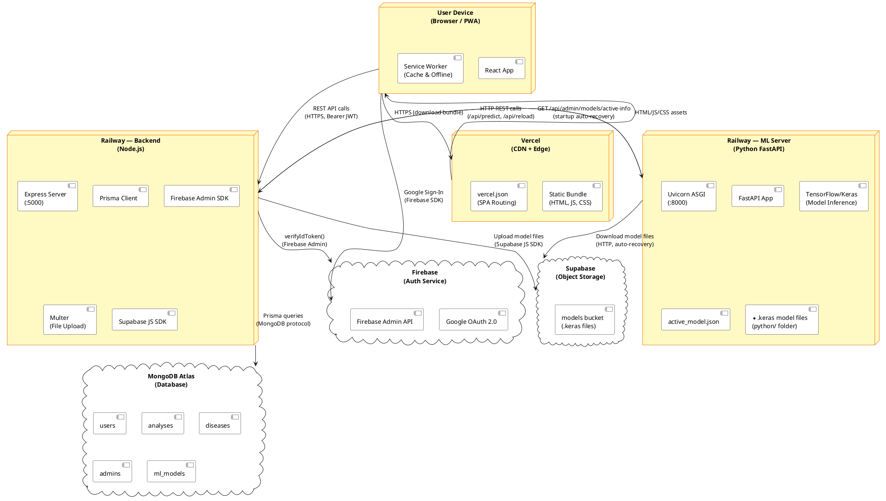
```plantuml
@startuml
skinparam nodeBackgroundColor #FFF9C4
skinparam nodeBorderColor #F57F17
skinparam componentBackgroundColor #FFFFFF
skinparam databaseBackgroundColor #E8EAF6

node "User Device\n(Browser / PWA)" as CLIENT {
  component [React App] as ReactApp
  component [Service Worker\n(Cache & Offline)] as SW
}

node "Vercel\n(CDN + Edge)" as VERCEL {
  component [Static Bundle\n(HTML, JS, CSS)] as StaticBundle
  component [vercel.json\n(SPA Routing)] as VercelConfig
}

node "Railway — Backend\n(Node.js)" as RAILWAY_BE {
  component [Express Server\n(:5000)] as Express
  component [Prisma Client] as Prisma
  component [Firebase Admin SDK] as FirebaseAdmin
  component [Multer\n(File Upload)] as Multer
  component [Supabase JS SDK] as SupabaseSDK
}

node "Railway — ML Server\n(Python FastAPI)" as RAILWAY_ML {
  component [Uvicorn ASGI\n(:8000)] as Uvicorn
  component [FastAPI App] as FastAPI
  component [TensorFlow/Keras\n(Model Inference)] as TF
  artifact [active_model.json] as ActiveJSON
  artifact [*.keras model files\n(python/ folder)] as ModelFiles
}

cloud "MongoDB Atlas\n(Database)" as MONGO {
  database [users]
  database [analyses]
  database [diseases]
  database [admins]
  database [ml_models]
}

cloud "Firebase\n(Auth Service)" as FIREBASE {
  component [Google OAuth 2.0] as GoogleOAuth
  component [Firebase Admin API] as FirebaseAPI
}

cloud "Supabase\n(Object Storage)" as SUPABASE {
  storage [models bucket\n(.keras files)] as ModelsBucket
}

' Connections
CLIENT --> VERCEL : HTTPS (download bundle)
VERCEL --> CLIENT : HTML/JS/CSS assets
CLIENT --> RAILWAY_BE : REST API calls\n(HTTPS, Bearer JWT)
CLIENT --> FIREBASE : Google Sign-In\n(Firebase SDK)
RAILWAY_BE --> MONGO : Prisma queries\n(MongoDB protocol)
RAILWAY_BE --> FIREBASE : verifyIdToken()\n(Firebase Admin)
RAILWAY_BE --> RAILWAY_ML : HTTP REST calls\n(/api/predict, /api/reload)
RAILWAY_BE --> SUPABASE : Upload model files\n(Supabase JS SDK)
RAILWAY_ML --> SUPABASE : Download model files\n(HTTP, auto-recovery)
RAILWAY_ML --> RAILWAY_BE : GET /api/admin/models/active-info\n(startup auto-recovery)

@enduml
```

---

## Cara Render Diagram

### Online
1. Buka [plantuml.com/plantuml/uml](https://www.plantuml.com/plantuml/uml/)
2. Copy-paste konten di antara `@startuml` dan `@enduml`
3. Klik "Submit"

### VS Code
Install extension: **PlantUML** (by jebbs)
- Shortcut: `Alt + D` untuk preview

### IntelliJ IDEA
Install plugin: **PlantUML Integration**

---

## Daftar Lengkap Diagram

| # | Tipe | Nama | Kegunaan |
|---|---|---|---|
| 1 | Use Case | Semua Fitur | Gambaran fitur untuk user & admin |
| 2 | Class | Seluruh Sistem | Struktur kelas, atribut, dan relasi |
| 3 | Sequence | User Login (Google OAuth) | Alur autentikasi user |
| 4 | Sequence | Image Analysis (Two-Pass ML) | Alur utama deteksi penyakit |
| 5 | Sequence | Admin Login | Alur autentikasi admin |
| 6 | Sequence | ML Model Management | Upload dan aktivasi model |
| 7 | Sequence | Auto-Recovery ML Server | Pemulihan model saat restart |
| 8 | Activity | Analisis Gambar | Flow dasar analisis |
| 9 | Activity | Admin Kelola Model | Flow manajemen model |
| 10 | Component | Arsitektur Sistem | Koneksi antar komponen |
| 11 | Swimlane Activity | Analisis Gambar (Detail) | Alur per aktor secara paralel |
| 12 | Swimlane Activity | Admin Manajemen Model | Alur admin per aktor |
| 13 | BCE Sequence | Analisis Gambar (BCE) | Alur dengan pola Boundary-Control-Entity |
| 14 | BCE Sequence | Autentikasi Pengguna (BCE) | Login dengan pola BCE |
| 15 | State | Status Analisis | Siklus hidup record analisis |
| 16 | State | Status Model ML | Siklus hidup model ML |
| 17 | Deployment | Infrastruktur Production | Topologi deployment sistem |
| 18 | Swimlane Activity | Admin Login (Swimlane) | Alur masuk administrator |
| 19 | Swimlane Activity | Admin Dashboard Stats | Pemrosesan statistik dashboard global |
| 20 | Swimlane Activity | Admin CRUD Penyakit | Alur pengelolaan data penyakit |
| 21 | Swimlane Activity | ML Server Health Check | Monitoring hardware & kesiapan server AI |
| 22 | BCE Sequence | Admin Login (BCE) | Alur masuk admin dengan pola BCE |
| 23 | BCE Sequence | Admin Stats Dashboard (BCE) | Mengambil metrik global dengan pola BCE |
| 24 | BCE Sequence | View & Search Diseases (BCE) | Pencarian & daftar katalog penyakit |
| 25 | BCE Sequence | Create Disease (BCE) | Penambahan penyakit baru ke DB |
| 26 | BCE Sequence | Update Disease (BCE) | Pengubahan data penyakit terdaftar |
| 27 | BCE Sequence | Toggle Disease Active (BCE) | Aktivasi status visibilitas publik penyakit |
| 28 | BCE Sequence | Delete Disease (BCE) | Soft-delete record penyakit |
| 29 | BCE Sequence | ML Model Upload (BCE) | Penerimaan & pendaftaran model AI baru |
| 30 | BCE Sequence | ML Model Activation (BCE) | Hot-reload model AI ke TensorFlow |
| 31 | BCE Sequence | ML Model Deletion (BCE) | Pembersihan model AI dari server |
| 32 | BCE Sequence | ML Server Health (BCE) | Pengecekan real-time status model AI |

> [!NOTE]
> Detail diagram admin nomor 18 s.d. 32 dapat dilihat secara lengkap di berkas terpisah: [admin_uml_diagrams.md](file:///home/ikhsan-dev/dev/bananavision/docs/admin_uml_diagrams.md).

---

Dokumentasi UML terakhir update: **June 5, 2026 (v3.2)**

